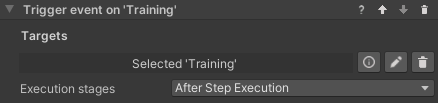

# States and Data for VR Builder
## Table of Contents

- [States and Data for VR Builder](#states-and-data-for-vr-builder)
  - [Table of Contents](#table-of-contents)
  - [Introduction](#introduction)
  - [Quick Start](#quick-start)
  - [Data Properties](#data-properties)
    - [Creating Data Properties](#creating-data-properties)
  - [Working with Data Properties](#working-with-data-properties)
    - [Set Value Behaviors](#set-value-behaviors)
    - [Reset Value Behavior](#reset-value-behavior)
    - [Compare Values Conditions](#compare-values-conditions)
    - [Utilities](#utilities)
    - [Logging Data Properties](#logging-data-properties)
  - [Math Operation Behavior](#math-operation-behavior)
  - [Trigger Event Behaviors](#trigger-event-behaviors)
    - [Trigger Event Behavior Parameters](#trigger-event-behavior-parameters)
  - [State Data Properties](#state-data-properties)
    - [Creating a State Data Property](#creating-a-state-data-property)
    - [Handling States in Code](#handling-states-in-code)
    - [Set State Behavior](#set-state-behavior)
    - [Check State Condition](#check-state-condition)
  - [Contact](#contact)

## Introduction

The States and Data add-on provides developers the tools to create processes more complex and customized than before.

Thanks to the support of variables in the VR Builder process, it is possible to store values to create triggers or track performance, and to create branching processes with a variety of outcomes.

The states feature allows VR Builder process to interact with objects in the scene by changing and reading states instead of handling all the object's logic. This allows the user to quickly write custom code and easily integrate it in the VR Builder process, opening the way to endless customization and better performance.

## Quick Start

You can check out the main features of this add-on in the provided demo scene. After importing the package in a properly set-up VR Builder project, you can access the demo scene from the menu `Tools > VR Builder > Demo Scenes > States and Data`. It is necessary to open the demo scene from the menu at least the first time, so a script will copy the required process file in the `StreamingAssets` folder.

The demo scene consists of a color mixing machine. The user adds bottles of color in the machine to mix a new color, then can press the button to spawn a ball of the created color. It uses the data properties included in this add-on for storing and calculating the mixed color, while the machine is controlled by states.

You can press Play to try out the scene, or open the Process Editor to check out how the process is made.

Additionally, you can find a tutorial on how this demo scene was created on our [website](https://www.mindport.co/vr-builder-learning-path/how-to-create-a-color-mixing-machine-in-vr).


## Data Properties

This add-on makes use of data properties to store values. A data property is a VR Builder property that stores one value of a defined data type, for example a number or a boolean. It is then possible to access those in the process steps to read or change the values.

There are four types of data properties in this add-on.

- **Number Data Property**: Stores a single number (C# type: float).
- **Text Data Property**: Stores a string of text (C# type: string).
- **Boolean Data Property**: Stores a true/false value (C# type: bool).
- **State Data Property**: Stores a state value. More detailed information [below](#state-data-properties) (C# type: int, exposed as enum).

### Creating Data Properties

We consider good practice to have each data property on a different, appropriately named empty game object, e.g. "Total Points". This way it is easy to keep track of them and drag them in the step inspector when needed.

To create the property itself, just add a `Data Property` component of the required type to the game object, or do it directly in the step inspector through "Fix it" button.

In the inspector, it is possible to type a default value for the data property. The property will have that value at the start of the process, and the `Reset Value` behavior will reset the property to its default. Additionally, it is possible to subscribe to the property events.


## Working with Data Properties

There are some standard tools to work with data properties. These are the Set/Reset Value behaviors, which are used to change the value stored in a data property, and the Compare Values conditions, which compare two values (from data properties or constant) to check if they are fulfilled.

### Set Value Behaviors

These behaviors set the value of a data property to a value specified in the step inspector. There is one behavior for each data property type. The available behaviors are listed here.

- Set Number
- Set Boolean
- Set Text
- Set State


### Reset Value Behavior

This behavior resets a data property's value to its default. This is zero for numerical values, false for booleans and an empty string for text, but a different default can be specified in the inspector of the data property. The property needs to be referenced in the step inspector, and will reset when the behavior is triggered.


### Compare Values Conditions

In States and Data it is possible to use a `Compare Numbers`, `Compare Text` or `Compare Booleans` condition. They work in a similar way, but the comparison operators differ. You'll need to select two values and the operation between them. Use the radio buttons to select if a value comes from a data property or is a constant entered in the step inspector. In the example below, the condition will be fulfilled when the Score Tracker value is equal or greater than the Point Threshold value.


### Utilities

Some data properties can have utility functions to make them handier to use with Unity events. At the moment the following utility functions are available:

- **Number Data Property**: You can use the `IncreaseValue(float)` function to increase or decrease the value of the data property.
- **Boolean Data Property**: you can use the `InvertValue()` function to switch it from *true* to *false*, or viceversa.

### Logging Data Properties

It can be useful to log value changes to data properties in the console for debugging purposes. This can be enabled globally by ticking the relevant box in `Project Settings -> VR Builder -> Settings`.

]

If the `Log Data Property changes` checkbox is enabled, changes to the value of the data property will be logged in the console like the following example. Note that the name provided is the game object's name.


## Math Operation Behavior

The `Math Operation` behavior performs an operation on a data property and updates it with the result of the operation. It takes three parameters, `Left Operand`, `Right Operand` and `Operator`.


`Left operand` is the data property that will be changed by the operation. `Right Operand` can either be another data property or a constant value entered in the inspector.
`Operator` defines the type of operation to perform.
The operators currently available are listed here.

- **Add**: left + right
- **Subtract**: left - right
- **Multiply**: left * right
- **Divide**: left / right
- **Min**: change left to the lowest value between left and right
- **Max**: change left to the highest value between left and right

For example, the operation in the image will add 1 to the `Blue` data property.

## Trigger Event Behaviors

This collection of behaviors let VR Builder trigger a Unity event on multiple scene objects. This gives you the freedom to bind your own functions to the event and execute custom code like it was a VR Builder behavior (although note that the behavior will end right after calling the event, so the next step could be activated immediately).

This is achieved through an event property which is added to the desired process scene object.



There are various permutations available for this behavior. It is possible to pass the following data to the event.
- No data
- Number (float)
- Text (string)
- Boolean

These value can be set in the behavior itself and can either be constant or data properties.


### Trigger Event Behavior Parameters

- **Targets** References to the scene objects holding the event property we want to trigger.
- **Argument** (Behaviors with data only): Lets you specify a parameter to pass to the event. The type of the parameter (or corresponding data property) can be Number (float), Text (string) or Boolean (bool).
- **Execution stages**: Lets you select if the event is triggered as soon as the step starts, just before the step ends or both.

## State Data Properties

Sometimes we need to simulate a complex behavior that is part of the environment rather than the process. For example, a machinery that can be idle, running, blocked or broken, or a door that can be locked, unlocked or open. In these case, it might make sense to code the object's logic directly with Unity Monobehaviors rather than trying to write very complex custom behaviors. This can also make sense if the object is independent from the process - for example, the machine will keep running regardless of the user's position in the process, or is designed to break randomly. 

Maybe we only want VR Builder to decide when the machine starts running, or to trigger a step when it breaks, but we don't need it to be in control of what exact animation the object is into, or what sound it plays - these are characteristics that are intrinsical to the machine, so we shouldn't care about them in the process.

We can use a `State Data Property` as a communication layer between our VR Builder process and some custom logic we have written for an object. This is a data property which contains an `enum` listing all the states an object can be in. Like all data properties, it can be read and set both from the Step Inspector and from code. This allows your custom logic and the VR Builder process to interact with each other.

### Creating a State Data Property

You will need to define your `enum` and create a state data property specific to it.
For the machinery described above, it could look like this.

```csharp
public enum MachineState
{
    Idle,
    Running,
    Blocked,
    Broken,
}
```

We then need to create a data property component using this enum from the generic state data property. This is just a couple lines.

```csharp
using VRBuilder.StatesAndData.Properties;

public class MachineStateDataProperty : StateDataProperty<MachineState>
{
}
```
We'll now be able to add this as a component to a game object. As it can be seen from the drop-down for the default value, it makes use of the `MachineState` enum.


### Handling States in Code

We can read and modify states from code calling the `GetState` and `SetState` methods on the data property component.

```csharp
MachineStateDataProperty stateDataProperty = GetComponent<MachineStateDataProperty>();

// Set a state to a specified value.
stateDataProperty.SetState(MachineState.Running);

// Read the current state.
MachineState state = stateDataProperty.GetState(); 
```
It is also possible to subscribe to the standard data property events `ValueChanged` and `ValueReset`, respectively called when the data property value changes or is reset to its default value.

```csharp
MachineStateDataProperty stateDataProperty = GetComponent<MachineStateDataProperty>();

// Subscribe to the value changed event.
dataProperty.ValueChanged += OnValueChanged;

// Function to be called when the event is triggered.
private void OnValueChanged(object sender, EventArgs e)
{    
    // Code to be executed on value changed.
}
```

### Set State Behavior

The `Set State` behavior can be used to change the property's state from the VR Builder process. It works very similarly to the `Set Value` behavior, the only difference being that the state drop-down will not be visible until a `State Data Property` is dragged in the inspector, as it depends on the provided enum.


It is also possible to use the `Reset Value` behavior on a `State Data Property`, it will work like any other data property.

### Check State Condition

It is possible for a process to read a state and react accordingly using the `Check State` condition. This condition compares a `State Data Property` to a specified value, in a way similar to other conditions comparing values.


A number of operations are available. Since enum values can be ordered, it is also possible to check if the state precedes or follows the specified one.

## Contact

Join our official [Discord server](http://community.mindport.co) for quick support from the developer and fellow users. Suggest and vote on new ideas to influence the future of the VR Builder.

Make sure to review [VR Builder](https://assetstore.unity.com/packages/tools/visual-scripting/vr-builder-201913) and this [asset](https://assetstore.unity.com/packages/slug/215557) if you like it. It will help us immensely.

If you have any issues, please contact [contact@mindport.co](mailto:contact@mindport.co). We'd love to get your feedback, both positive and constructive. By sharing your feedback you help us improve - thank you in advance!
Let's build something extraordinary!

You can also visit our website at [mindport.co](http://www.mindport.co).
