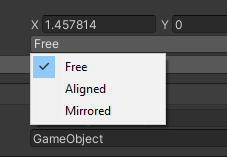
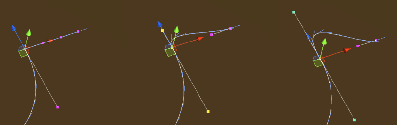

# Animations for VR Builder
## Table of Contents

- [Animations for VR Builder](#animations-for-vr-builder)
	- [Table of Contents](#table-of-contents)
	- [Introduction](#introduction)
	- [Quick Start](#quick-start)
	- [Behaviors](#behaviors)
		- [Animation](#animation)
			- [Animate Transform](#animate-transform)
				- [Introduction](#introduction-1)
				- [Inspector](#inspector)
			- [Follow Path](#follow-path)
				- [Introduction](#introduction-2)
				- [Inspector](#inspector-1)
				- [The Bezier Spline Path Property](#the-bezier-spline-path-property)
			- [Rotate Around Axis](#rotate-around-axis)
				- [Introduction](#introduction-3)
				- [Inspector](#inspector-2)
			- [Set Animator Parameter](#set-animator-parameter)
				- [Introduction](#introduction-4)
				- [Inspector](#inspector-3)
			- [Show Exploded View](#show-exploded-view)
				- [Introduction](#introduction-5)
				- [Inspector](#inspector-4)
	- [Contact](#contact)

## Introduction
This add-on contains a collection of animation behaviors that allow VR Builder to display more complex animations than what is possible with the built-in tools.

When installed, the `Move Object` core behavior will be disabled in the menu, as its functionality is 100% included in the new `Animate Transform` behavior. To manually enable it, go to `Tools > VR Builder > Developer > Allowed Menu Items Configuration`.

## Quick Start
The easiest way to get started with this add-on is to check out the included demo scene.

If it is the first time you open the demo scene, you will have to do it through the menu: `Tools > VR Builder > Demo Scenes > Animations`. This is necessary as a script will copy the demo course in the StreamingAssets folder. After the first time, the demo scene can be opened normally.

Press Play to try out the behaviors included in this add-on. The demo scene includes a station for every behavior. You can teleport there and check out some practical uses of the included behaviors.

## Behaviors
### Animation
#### Animate Transform
##### Introduction
This behavior animates a game object by changing its position, rotation and scale over time until it matches those of a "transform provider" game object. It is possible to set how position, rotation and scale are animated over time through separate animation curves.
The behavior can be found under `Animation > Animate Transform`.

##### Inspector

The **Animate Transform** behavior accepts the following parameters.

**Object**: The game object to be moved.

**Final transform provider**: The game object which provides the final position, rotation and scale of the animation.

**Duration (in seconds)**: Duration in seconds of the animation.

**Position curve, Rotation curve, Scale curve**: These animation curves determine the object's transform at a given point in time. The curve can have values from 0 (the object's original position, rotation or scale) to 1 (the transform provider's position, rotation or scale). Note that the length of the curves is normalized: while it is possible to have the time axis greater or lesser than 1, this won't affect the duration of the animation - it is recommended to leave the time axis to the default length of 0 to 1.

**Ping pong**: If this is checked, the animation will play backwards after finishing, resulting in the object animating and then returning to the original position. Note the total duration will be twice the value in the `Duration` field. This is similar to creating a symmetrical velocity curve, like for example a bell shape.

**Repeats**: The number of times the animation will repeat. Note that each repeat will increase the duration of the animation by its full amount. If ping pong is set, it will be included in every repeat.

#### Follow Path
##### Introduction
This behavior animates a game object so that it follows a path, for example a spline. It is possible to set a curve determining how fast the object moves along the path, plus a number of options described below.
The behavior can be found under `Animation > Follow Path`.

##### Inspector

The **Follow Path** behavior accepts the following parameters.

**Object**: The game object to be moved.

**Path**: The path the object will follow. This needs to be an `IPathProperty`, like the `BezierSplinePathProperty` provided in VR Builder Core.

**Keep relative position**: If unchecked, the object will be teleported on the path when the animation starts, and its position throughout the animation will be on the path itself. If checked, the object will retain its current position and move parallel to the path while animating.

**Keep relative rotation**: If unchecked, the object will rotate so that its forward vector follows the direction of the path throughout the animation. If checked, the object will retain its current orientation, but still rotate following the direction of the path.

**Duration (in seconds)**: Duration in seconds of the animation.

**Velocity curve**: This animation curve determines the object's position on the path at a given point in time. The position on the path can be a value from 0 (start) to 1 (end). Note that the curve length is normalized: while it is possible to have the time axis greater or lesser than 1, this won't affect the duration of the animation - the curve will be extended or compressed to fit the provided time duration. The first key of the curve should always be at 0 on the horizontal axis.

**Disable Rotation**: 
If enabled, the object will not rotate while following the path and the settings on _Keep relative rotation_ will be ignored.

**Reverse**: Utility checkbox that plays the animation backwards. It is equivalent to mirroring the velocity curve.

**Ping pong**: If this is checked, the animation will play backwards after finishing, resulting in the object animating and then returning to the original position. Note the total duration will be twice the value in the `Duration` field. This is similar to creating a symmetrical velocity curve, like for example a bell shape.

**Repeats**: The number of times the animation will repeat. Note that each repeat will increase the duration of the animation by its full amount.

##### The Bezier Spline Path Property
The `BezierSplinePathProperty` is an implementation of the `IPathProperty` interface included in VR Builder core, and can thus be used to create paths for the **Follow Path** behavior.
It's recommended to add it to an empty game object. It will automatically add a `BezierSpline` component, which will display a default 4 point Bezier curve in the scene.

It is possible to select and move the points in 3D space to manipulate the curve.

We can see the position of the currently selected point in the inspector.

By clicking **Add Curve** in the `BezierSpline` inspector, we can add a second bezier curve connected to the current one.

With a point selected in the inspector, it is possible to change the point mode.

The color of the point changes depending on the mode selected. The following modes are available.

**Free** (Magenta): The handles of the adjacent curves are independent, and can form a sharp angle if not aligned.

**Aligned** (Yellow): The handles of the adjacent curves are aligned, so there will be a smooth transition, but their length can be set individually.

**Mirrored** (Cyan): The handles of the adjacent curves are aligned and of equal length.

Other options are:

**Loop**: Will close the path to form a loop. Especially useful with repeats, as the object will keep going around the path.

**Approximate Linear Velocity**: Normally, velocities on a Bezier curve are non-linear. This means that, by default, the object's speed will change depending on where it is on the path and which curve it is on. Enabling this option will make the object approximate a linear speed, which means that the animation speed will be actually more faithful to the animation curve.

**Granularity of Approximation**: This parameter is only exposed if `Approximate Linear Velocity` is selected. It determines the number of segments each curve will be subdivided in, a higher value will result in a more constant speed along the path, very low values (less than 10) can cause the object to change speed in a strange way. Lowering the value can increase performance.

#### Rotate Around Axis
##### Introduction
This behavior rotates an object around a given axis. The object rotates a specified amount of degrees in a given time. The axis can be represented by a second transform, and it is possible to choose whether the object will rotate around the X, Y or Z axis of that object.

##### Inspector

It is possible to configure the following parameters.

**Object**: The object to be rotated.

**Rotation Axis Provider**: The object defining the position of the rotation axis. If none is selected, the axis will pass through the origin of the rotating object, which in most cases means that the object will rotate on itself.

**Rotation Axis**: The local axis of the provider object which will be used to rotate around.

**Duration (in seconds)**: The total duration of the animation.

**Animation Curve**: Defines the state of the animation over time. The X axis represents the duration of the animation (normalized), while the Y axis represents values from the object's initial rotation (0) and the object's target rotation defined above (1).

#### Set Animator Parameter
##### Introduction
This set of behaviors allow to control the parameters of multiple `Animator` components from within VR Builder.
The included behaviors are:

- Set Animator Trigger Parameter
- Set Animator Boolean Parameter
- Set Animator Integer Parameter
- Set Animator Float Parameter

These behaviors set the specified parameter to the desired value immediately. The float variant can additionally change the parameter over time, following an animation curve.

##### Inspector

The inspector for these behaviors works similarly for all variants, although not all variants have all options. The behavior makes use of the following parameters.

**Animator**: `Process Scene Objects` containing an `Animator Property`. As usual, it is possible to automatically add the property, but the user should ensure there is a configured `Animator` component present on the same game object as the property.

**Parameter name**: The name of the parameters in the Animator as a string.

**Target value** (not present on trigger): The desired new value for the parameter. It is not present on the Set Animator Trigger behavior as triggers don't store values.

**Duration (in seconds)** (float only): The amount of time in seconds before the float parameter reaches its final value. If set to 0, the value will change instantly like in the other behaviors.

**Animation curve** (float only): Describes how the float value changes over time. The X axis represents the duration of the transition, while the Y axis represents the current value, with 0 being the initial value and 1 the target value.

#### Show Exploded View

##### Introduction
This behavior lets you easily create an exploded view of an object with a number of child objects. By default, all immediate children of the specified game objects will be displaced by the specified factor relative to their current local position. This means that children with a local position of zero will not be displaced. Note that you can create empty objects with the desired relative positions in order to achieve the desired effect.

It is also possible to manually set which child objects will be displaced. You can do so by adding them to the `Explodable Child Objects` list on the `Explodable Property` of the target object. If the list is not empty, only the objects in the list will be exploded, otherwise all first-level children will be selected.

##### Inspector

**Object**: The game object to be exploded.

**Scale**: How much the children will displace themselves from their initial position. A scale of 1 represent the initial position and can be used to un-explode the view. Values above 1 will explode the view, and below 1 will implode.

**Duration (in seconds)**: Duration in seconds of the animation.

**Explosion curve**: This curve determines the object's position at a given point in time. The curve can have values from 0 (the child's original position) to 1 (the final position). Note that the length of the curves is normalized: while it is possible to have the time axis greater or lesser than 1, this won't affect the duration of the animation - it is recommended to leave the time axis to the default length of 0 to 1.

**Ping pong**: If this is checked, the animation will play backwards after finishing, resulting in the object animating and then returning to the original position. Note the total duration will be twice the value in the `Duration` field. This is similar to creating a symmetrical velocity curve, like for example a bell shape.

**Repeats**: The number of times the animation will repeat. Note that each repeat will increase the duration of the animation by its full amount. If ping pong is set, it will be included in every repeat.

## Contact

Join our official [Discord server](http://community.mindport.co) for quick support from the developer and fellow users. Suggest and vote on new ideas to influence the future of the VR Builder.

Make sure to review our [asset](https://u3d.as/2GRa) if you like it. It will help us immensely.

If you have any issues, please contact [contact@mindport.co](mailto:contact@mindport.co). We’d love to get your feedback, both positive and constructive. By sharing your feedback you help us improve - thank you in advance!
Let’s build something extraordinary!

You can also visit our website at [mindport.co](http://www.mindport.co).
