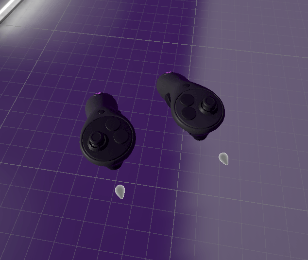
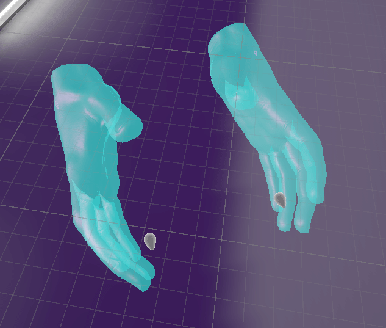
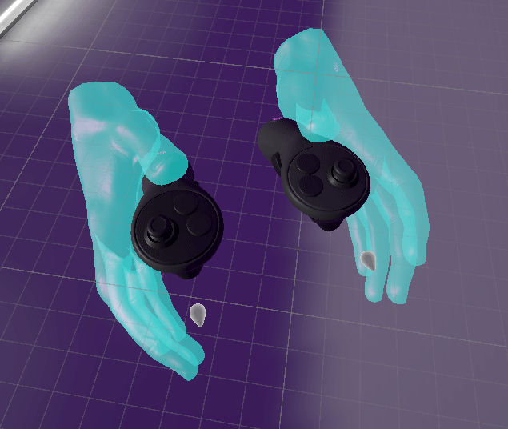

## Controller Visualization

By default, the VR Builder rig visualizes the VR controllers as generic controllers. With some small modifications on the rig, you can change this to show animated hands that react when pressing the grip or trigger button on your controller.

### Animated Controllers

To show or hide the controller visualization, navigate to `Left Controller Visual` and `Right Controller Visual` inside the rig and enable or disable them.

### Animated Hands

To show or hide the hands visualization, navigate to `Left Hand Visual` and `Right Hand Visual` inside the rig and enable or disable them.

### Dual Visualization

It is possible to show both controllers and hands at the same time by having both visualizations active. However, our priority was that the animated hands work well on their own and interact smoothly with the grey `Poke Point` and the teleport ray. Because of this, the hand and finger positions are not accurately mapped to the controller buttons.

