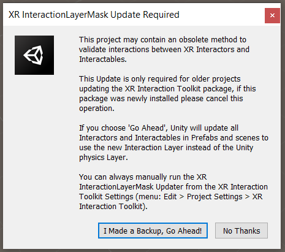
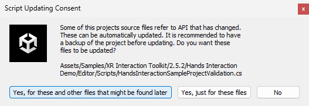
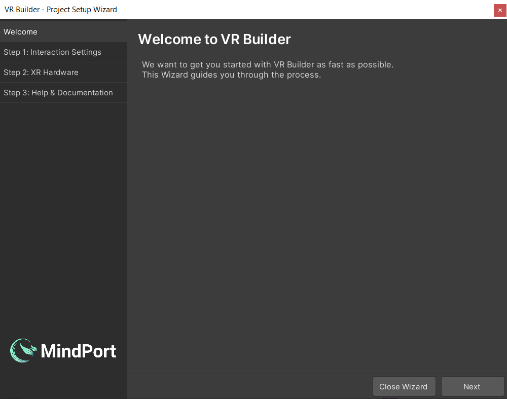
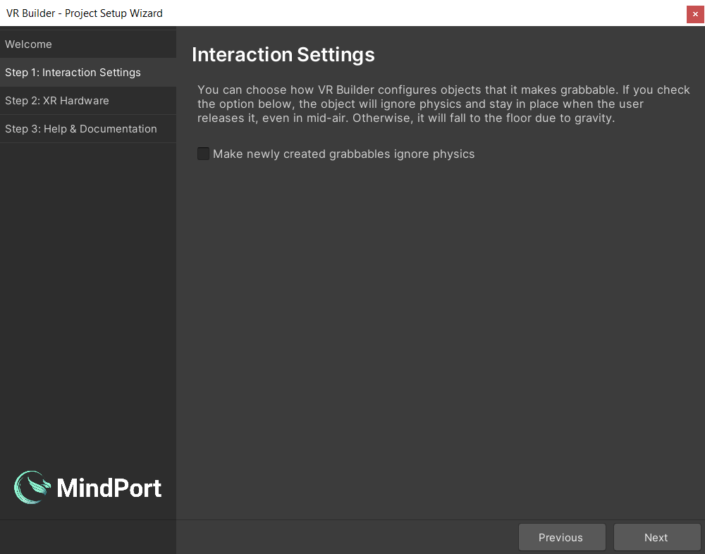

## Installation

You can get VR Builder from the [Unity Asset Store](https://assetstore.unity.com/packages/tools/visual-scripting/vr-builder-201913) or from our [GitHub](https://github.com/MindPort-GmbH/VR-Builder/releases). In the first case, you will be able to download and import the VR Builder package from the package manager. If you have downloaded a .unitypackage from GitHub, just import it in the project.

If you are creating a new project, select `Universal 3D` template. Note that it is not necessary to choose the `VR` template as VR Builder will configure the project for VR automatically.

After importing, VR Builder will compile and import some dependencies. 

For older Unity versions, a dialog from Unity's XR Interaction Component appears. VR Builder should work with either choice, so select the option that better suits your existing project. Use `I Made a Backup, Go Ahead!` if you are starting a new project. This will trigger an automated restart.

For newer Unity versions the Samples of the XR Interaction Toolkit might need an update.

After these notifications the Project Setup Wizard will appear.

### Guide Through the Project Setup Wizard
The Setup Wizard helps to get new or existing Unity scenes set up and ready to be used with VR Builder. 

#### Welcome
In the following we will guide you through the different tabs of the VR Builder Setup Wizard.
Click `Next` to proceed to the interaction settings page setup page.

#### Interaction Settings
Here you can configure some default settings related to VR Builder interactions. Right now, the only available setting will determine whether a newly created grabbable object will use physics or not. You can also change these options at any time in `Project Settings > VR Builder > Settings`.

#### XR Hardware Setup
Then, if it's not configured already, you will be able to configure your project to work with your VR hardware. If your hardware is not listed but supports OpenXR, select Other. You might need to finish the configuration under Project Settings -> XR Plug-in Management. If your device is not supported, please reach out to us in the VR Builder Community. The packages for the selected hardware will be imported after closing the wizard.

#### Unity Localization

Finally you must choose whether to set up localization support or skip it for now. VR Builder supports localization through the Unity Localization package. When setting up localization, the wizard will guide you through the manual steps required for a localized project. It provides a useful checklist and some shortcuts to make the task easier. It also has links that redirect to the relevant Unity documentation. If you decide to skip this setup, VR Builder will work in a single language. You can perform localization setup at any time. We encourage you to use Unity Localization, even if you use just one language. With Unity Localization, you will have all your texts in one place inside the Unity Localization Tables, which in turn will give you the possibility to export and refine them and import them back into Unity. Note that as of January 2024, we do not support asset localization tables. See [Resources path/Key](https://github.com/MindPort-GmbH/VR-Builder/blob/develop/Documentation/vr-builder-manual.md#configuration) in the Documentation on how to localize audio files.

#### Help & Documentation

This page lists some useful resources to get you started with VR Builder. There is also a checkbox which lets you choose if the demo scene should be loaded after closing the wizard.After clicking Finish, VR Builder is set up! You will need to wait a few seconds for packages to import if you selected a headset from the hardware list. Then, feel free to try out the demo scene or create your own scene by selecting `Tools > VR Builder > Scene Setup Wizard…`.

If the demo scene or any other asset looks solid magenta there is an issue with the shader of the material. The Demo Scenes in VR Builder VR Builder version 5 uses the Universal Render Pipeline (URP).

To convert the materials from the SRP to URP, follow the Unity Manual using the [Render Pipeline Converter](https://docs.unity3d.com/6000.0/Documentation/Manual/urp/features/rp-converter.html).

