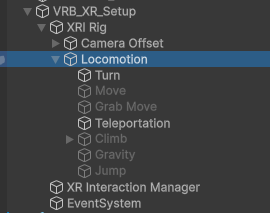

## Locomotion

By default, the default rig supports locomotion by teleportation, continuous movement and climbing. You can modify the locomotion styles supported by your rig by enabling or disabling the child objects of the `Locomotion` object on the rig.

### Continuous Movement

Continuous movement is controlled by default with the thumbsticks. Left to move around, right to turn on the spot. We suggest caution in using this locomotion solution as it can cause motion sickness in inexperienced users. However, it can still be useful for specific use cases, precision adjustments or testing.

### Teleportation

Teleportation requires the user to push the right thumbstick forward, then release while pointing at a teleportable surface or anchor. Teleportation requires a little more setup to work properly, but most of it is handled automatically by VR Builder.

It is recommended for teleportation to work on different layer than normal interactions. By default, VR Builder uses the `Teleport` raycast layer for raycasts from the teleportation controllers, and the `Teleport` XRI interaction layer for teleportation interaction. When imported, VR Builder will attempt to create both layers at the index 31 of the respective layer arrays.

Interactors and interactables need to be configured with these layers in order to work. When a new scene is created, the teleport interactors on the default rig are automatically configured to raycast and interact on these layers.

Likewise, when creating a teleportation anchor or area, you should use the `Teleportation Anchor (VR Builder)` or `Teleportation Area (VR Builder)` components instead of the XRI versions. These include a button in the inspector which automatically configures them to settings compatible with the VR Builder rig, including layer settings.
The teleportation anchor in particular also includes more options, explained below.

**Set Default Teleportation Anchor**: Creates a default anchor by adding a collider to the game object and a graphical representation of the anchor (a feet silouhette inside a circle).

**Add Snap Volume**: Configures the anchor so that the teleportation ray snaps to it when it's in the vicinity.

**Add Interaction Affordance**: Adds feedback when the user interacts with the anchor.

**Add Proximity Entry**: If this is enabled, the user will be considered teleported at the anchor even if they get close by walking or stick locomotion. This can be relevant if the VR Builder process includes a [Teleport condition](teleport-condition.md) to that anchor.

Teleportation should be easy to setup and just work out of the box. In case something does not, for example when editing an old scene or after changing the position of the XR Teleport layer, it is possible to reset the layers on the rig and all anchors and areas in the scene. To do so, select `Tools > VR Builder > Developer > Configure Teleportation Layers`. Note that this will overwrite your existing layer masks and select the `Teleport` layer on all of them.
