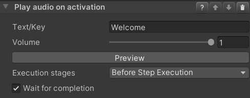

### Play TextToSpeech Audio

#### Description

The Play TextToSpeech Audio behavior uses a synthesized voice to read text. It supports localized text through Unity's
Localization package.

By default, VR Builder works with a single language. In `Project Settings > VR Builder > Language` you can specify which
language will be used by the TTS engine.

VR Builder can also be configured to use the Localization package from Unity to provide localized text. The Project
Setup Wizard can guide you through the steps, which are the same as outlined in the
official [documentation](https://docs.unity3d.com/Packages/com.unity.localization@1.0/manual/QuickStartGuideWithVariants.html).

VR Builder will automatically switch to localized mode when a Localization Settings object has been created.

#### Configuration

- **Text/Key**

  If the project is not configured for localization, this field can be used to enter the text that will be spoken in the
  language configured in the Project Settings.

  If localization is configured, meaning that a Localization Settings object has been created, you need instead to enter
  the key to look for in the localization table associated with the process.

- **Volume**

  The volume at which the audio should be played.

- **Execution stages**

  By default, steps execute behaviors in the beginning, in their activation stage. This can be changed with the
  `Execution stages` dropdown menu:

    - `Before Step Execution`: The step invokes the behavior during its activation.
    - `After Step Execution`: Once a transition to another step has been selected and the current step starts
      deactivating, the behavior is invoked.
    - `Before and After Step Execution`: Execution at activation and deactivation of a step.

- **Wait for completion**

  By default, the step waits for the audio file to finish. If you want the step to interrupt the audio in case the
  trainee completes the conditions, uncheck this option.

  Note: this might lead to an audio file not even being started, in case the step ends immediately.
