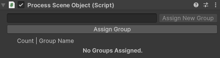

## Process Scene Objects

The `Process Scene Object` component acts as a bridge between the VR Builder process and a Unity game object. If the
process needs to observe or interact with a game object, it does so through this component. This means that every game
object referenced in the process is required to have this component. If a more detailed interaction is needed, property
components can be added to provide VR Builder more control on the object. For example, adding a `Grabbable Property`
component will make the object grabbable, and VR Builder will be able to check if the object has been grabbed.

The `Process Scene Object` generates a hidden object ID which identifies the object internally in the VR Builder
process.

In addition, it is possible to associate an arbitrary number of groups to every scene object. Some behaviors and
conditions can interact with unspecified objects within a certain group rather than a specific object with a given
object ID.

You can select and assign an existing group from the list, or create and directly assign a new group. You can unassign a
group from an object by clicking the X button next to it. Groups are stored on a per-project basis and can be created,
edited or deleted from `Project Settings > VR Builder > Scene Object Groups`.

It is possible to edit multiple Process Scene Objects at the same time to add or remove groups in bulk. When multiple
objects are selected, all groups on all objects are listed.

If a group is present only on some of the selected objects, it will be displayed in *italics*. A default text style
means that the group is present on all selected objects.
