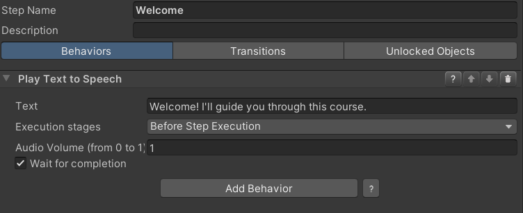
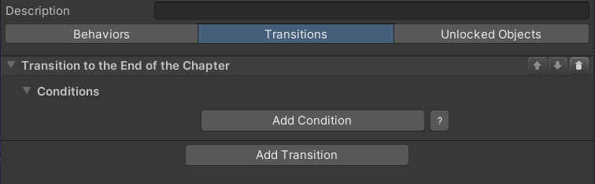
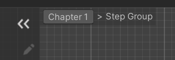

## Quick Start

You can get a first impression of VR Builder and its features by accessing  the provided demo scene. This sample scene contains a pre-built process that showcases some of the interactions provided in VR Builder.

You can automatically open the demo scene at the end of the setup wizard, or use the shortcut in `Tools > VR Builder > Demo Scenes > Core`. Note that, while the scene can be found and opened from disk, it is necessary to use one of the above methods at least once in order to automatically copy the process file to the StreamingAssets folder, where VR Builder processes are saved.

### Demo Scene Overview

The demo scene showcases how to assemble a process with the building blocks included in VR Builder. More building blocks and features are available as separate add-ons.

These building blocks are either conditions or behaviors. Conditions check if the user or the world is in a certain state, and behaviors modify the world state when activated.

The process in the demo scene is linear, and will guide the user through different steps. To try out the demo scene, ensure audio volume is up, or you won't be able to hear the spoken instructions!

### Demo Scene Hierarchy

In the hierarchy there are three game objects in parentheses.

They are automatically added to every VR Builder scene.

- `PROCESS_CONFIGURATION` allows to select the process for the current scene from a list of processes saved in the project.
- `PROCESS_CONTROLLER` defines some parameters for processes in this scene like the spectator input bindings and camera.
- `VRB_XR_Setup` is the VR rig used by the default XR interaction component. If you are using a different interaction component, for example to use VR Builder in conjunction with [Interhaptics or VRIF](https://www.mindport.co/vr-builder/add-ons-integrations), you might see a different rig here.

By looking at the other objects in the scene, we can see that some have a `Process Scene Object` component and possibly some "property" component. A `Process Scene Object` has a unique object ID that can be accessed by the process. Properties define how the process can interact with the object. For example, a `Grabbable Property` will let VR Builder recognize if an object is being grabbed. Adding a `Grabbable Property` to an object will automatically make it a `Process Scene Object` and add a few components so you can interact with the object in VR.

If these properties are not added manually you will usually be prompted to add them automatically when building the process of your VR application.

### Customizing the Rig

When creating a VR Builder scene, the default rig is created directly in the scene and can be edited or replaced like any game object. If you plan to use the same rig in multiple scenes, just create a prefab of it and manually replace the default rig.

The only requirement every VR Builder rig has, independent of the interaction system, is that it must contain a `User Scene Object` component. This component identifies the rig as the user, and is usually placed on the root of the rig. It should reference the head, hand and base transforms, so that VR Builder can access those positions when needed. If left empty, it will attempt to find the head by itself by looking for the camera's transform.

It is also possible to add other `Process Scene Object`s on the rig in order to use hands, backpacks, toolbelts and so on in behaviors and conditions, depending on the use case.

### Process Editor

The process editor lets you design the process of your VR application. You can open the process editor from `Tools > VR Builder > Process Editor` or `Window > VR Builder > Process Editor`. The process editor for the demo scene should look like this.

#### Chapters view
On the left, there is a list of chapters. Every chapter is a separate section of the process. They are useful to separate a process in its logical steps and avoid too much clutter in a single graph. 

You can click on the different chapters to visualize the corresponding graphs.

Next to the chapter name, there are icons that allow you to move the chapter up and down in the list, rename it or delete it.

Underneath, you can see the `Connections breakdown` foldout. Expand it to see incoming and outgoing connections for the current chapter. That is, which chapters lead here and to which chapter it is possible to go from this one. The number next to each connection represents the amount of steps that connect to the chapter. When "Next Chapter" or "Previous Chapter" is listed as a connection, it means the connection is implicit: a path ends with an empty transition, which by default ends the current chapter and starts the next one in order.

The demo scene is linear, meaning that each chapter will lead directly to the next and the connection overview only contains implicit connections, but it is possible to create more complex processes that don't follow the chapter list linearly.

#### Graph view
On the right, there is a graphical representation of the current chapter. Every node is called a `Step`. Every step can include a number of `Behaviors` which can happen when the node is triggered or before leaving it. In the demo scene, those are mostly text to speech instructions and animations. A step can have as many exit points, called `Transitions`, as needed. Every transition can list a number of `Conditions` which, if fulfilled, make the transition valid.

Select the "Welcome" node in the first chapter. This will open the Step Inspector. The window should look like the following.

The only behavior is a text to speech instruction that will be triggered when the node is entered. Click on the "Transitions" tab.

There is a single transition. A step can have multiple transitions, each leading to a different step. In this case, the transition is connected to no other step, so it will end the chapter. The next chapter, "The magic cube", will then start.

Transitions can include conditions. If they do, they will trigger only when the attached conditions are completed. This transition has no conditions, so it will trigger immediately after the current step has ended, without any input from the user.

We encourage you to investigate the other nodes to understand how the demo scene is built.

#### Step Nodes
You can create a node by right clicking anywhere in the graph and selecting `New`, then the type of node you want to create. There are four types of node available in VR Builder core:

##### Step

This is the default step node, the main building block for your process. By default, it is empty. This means that nothing will happen, and the execution will immediately proceed to the next node, if present. You will need to add behaviors and conditions to it in the `Step Inspector` in order to customize it and build your process logic.

##### Step Group

This node doesn't let you set conditions and behaviors, but instead can be expanded in a new node graph. It can be populated with other step nodes and act as a "sub-chapter" with some self contained logic. This can help keeping the process tidy.

You can access the node's graph by clicking the `Expand` button or double clicking on the node itself. There are also context menu options for expanding the node or ungrouping it - that is, replacing it in the main graph with the logic it contains.

This node only has one entry and one exit point. This means that after the contained logic has ended executing, the process will always continue executing from the exit transition of the group node.

If you are in a step group graph, it will be indicated on the top left of the process editor.

You can click on a parent to return to it. For example, clicking on "Chapter 1" will get you back to the main chapter graph.

You can also create a group by selecting a sequence of nodes, right clicking and selecting `Make group`. Since the step group node only has one input and one output, this works best when selecting linked nodes only. Edge cases are resolved as follows:
- If there are two or more inbound connections in the group, all will lead to the group's input. The first valid node will be chosen as starting step for the group, while the others will have their connection severed.
- All outgoing connections will be deleted, meaning that the process will continue from the output of the group node after the group has processed. This means that if the selected nodes lead to multiple other nodes, now they will all go through the group's output.
- The step group output will be connected to the previous target of the first valid grouped node. Other external targets in grouped nodes are ignored, which means that when the group ends it will always go to the same following node.

If you encounter one of these edge case, make sure to review your process logic after grouping, as it may have changed.

##### Parallel Execution

The parallel execution node lets you execute two or more step sequences at the same time. Execution will continue to the next node once all parallel sequences have completed.

Clicking on a Parallel Path button will open a new graph where the path can be edited. This is very similar to a step group, with the difference that there can be multiple parallel paths and they are all executed at the same time.
Like with step groups, it is possible to return to the main process by clicking the root chapter on the top left of the process editor.

The buttons next to a parallel path let you make the path optional, rename it or delete it. Non-optional paths are displayed with the continuous arrow icon, while the interrupted arrow icon denotes a path that is optional.

When all non-optional paths have finished execution, the node ends execution as well. All optional paths are immediately interrupted. It can be useful to create optional paths to display looping animations, recurring hints and so on - they can even be endless loops without an exit point, as they will be interrupted anyway when the step ends.

The "+" button at the bottom lets you add more parallel paths. There is no theoretical limit to the number of paths in a parallel execution node, but a too high number might impact performance.

##### End Chapter

You can use this node as the last node on a sequence. It will immediately end the current chapter and start a new specified chapter, which can be selected from a drop-down list. This is useful to move through the chapters in a non-linear fashion. Note that you are not required to use this node for linear processes, as a chapter will automatically end when an empty transition is reached. In that case, the process will simply proceed to the following chapter.

