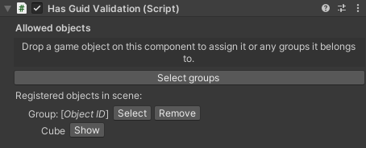

### Snap Object

#### Description

The Snap Object condition is fulfilled when any of the `Objects` is released into the `Zone to snap into`, which means the collider of any of the Objects and collider of the Zone overlap. Adapt the collider size of the snap zone to increase or decrease the area where the user can release an `Object`. Increasing the collider size of the snap zone decreases the required *snap* precision and simplifies the user's interaction in VR. 
After the user releases an `Object`, this is moved to the snap zone's `SnapPoint`. To adjust this position, change the position of the SnapPoint child object of the `Zone to snap into` object.

- **Snap Zone Generator**

    For any snappable object you can generate a snap zone that can snap this object and can be used as a `Zone to snap into`. To do so, navigate to the `Snappable Property` in Unity's Inspector. You will see two buttons. Clicking on the button `Create Snap Zone for this object`, you will create a snap zone that only accepts this exact object. Clicking on `Create Snap Zone for objects in the same groups` will instead create a snap zone that accepts every object that shares at least a group with the current object. Note that the current object will still determine the shape of the snap zone's ghost object.
    
    

    If you want a specific snap zone behavior, like for example accepting only one group of the source object instead of all of them, you'll have to manually change that. Select the snap zone and find the `Has Guid Validation` component. If you manually created your snap zone, you might have to add this component manually as well.
    Add to the list the objects you want to be valid for this snap zone. You can reference single objects by object ID, or entire categories of objects via groups.

    

- **Manual Snap Zone Creation**
  
    Instead of the automatic generation as described above, you can do those steps also manually. Please refer to available documentation on the `XRSocketInteractor` from Unity or related sources. You can also make changes to the automatically created snap zone to adapt it to your needs. Please note that these changes might impact the process logic.

- **Feed Forward for Snap Zones**

    Snap zones are restricted to which objects can be snapped. This means every object can be valid (i.e. it can be snapped to this zone) or invalid (it can not be snapped to this zone) for a snap zone. This is achieved with validation components on the snap zone, for example the `Has Guid Validation` component. You can use this component to configure which specific objects or groups are accepted by the snap zone.
    In case you are moving a valid object into a zone, the snap zone color changes to ‘Validation Color’ (green), providing the user in VR with positive feedback. In case you are moving an invalid object into a zone, the snap zone color changes to ‘Invalid Color’ (red), giving the user the feedback that this is the wrong object for this zone. 
    You can modify the colors and materials to be used in the Snap Zones parameters and settings.

- **Snap Zone Parameters and Settings**

    To change the highlight color or validation hover material of a dedicated snap zone, navigate to the snap zone object in the Unity Inspector. You will find the Snap Zone Parameters and Settings in the script `Snap Zone`.

    

    To change the colors and materials of all snap zones in the scene, select them in the VR Builder snap zone settings and press 'Apply settings in current scene'.

    

    The snap zone settings can be found in the project settings in tab `VR Builder > Settings > Snap Zones`.

#### Configuration

- **Objects**

    The `Process Scene Objects` to place (snap). The objects needs to have the `Snappable Property` and a collider component configured. 

- **Zone to snap into**

    This field contains the `Process Scene Object` where any of the `Objects` are required to be snapped. Make sure the object has a collider component with the `Is Trigger` property *enabled*.