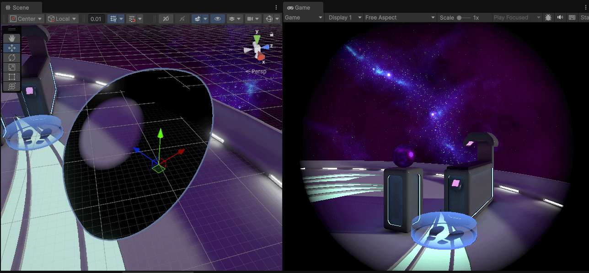

#### Tunneling Vignette

The tunneling vignette improves comfort during continuous movement. By default, the vignette is configured to activate whenever any continuous [Locomotion](locomotion.md) method is in use on the rig.

#### Configure Tunneling Vignette

To configure it, search for the `TunnelingVignette` game object in the rig. For detailed explanations of the tunneling vignette settings, refer to the [XR Interaction Toolkit documentation](https://docs.unity3d.com/Packages/com.unity.xr.interaction.toolkit@3.1/manual/tunneling-vignette-controller.html).

