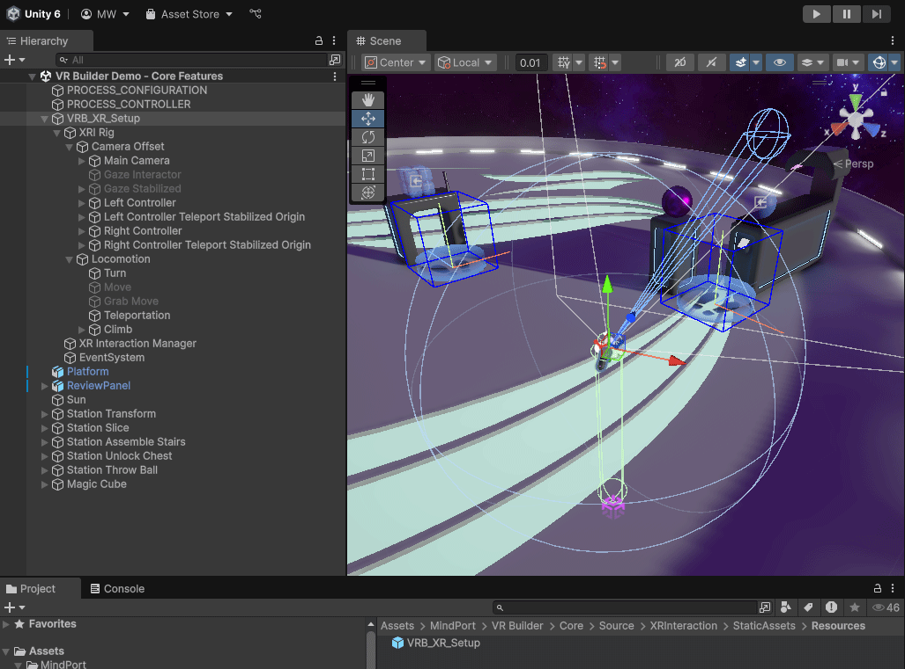

## XR Rig

The XR Rig is a game object that anchors the user’s head mounted display, controllers, or user’s hands when using hand tracking within the virtual space. Essentially, it represents the user in the scene. On the rig, you can configure which types of locomotion and interaction are available to the user.

### VR Builder XR Rig

When creating a new scene with the VR Builder Scene Setup Wizard, you get a `VRB_XR_Setup` game object automatically added to the scene. `VRB_XR_Setup` is the VR Builder XR Rig and is built upon the suggested standards set by the Unity XR Interaction Toolkit. Therefore, `VRB_XR_Setup` is very similar to the `XR Origin (XR Rig)` found in the XR Interaction Toolkit samples but has some additional VR Builder–specific scripts added.

The `VRB_XR_Setup` game object is a fully unpacked copy of the prefab with the same name. If you are familiar with Unity’s prefab workflows you can use the prefab or better your own prefab variant of it.

### VR Builder XR Rig with Hand Tracking

VR Builder also includes an XR Rig that supports hand tracking. To use it, search for `VRB_XR_Setup_Hands` in the VR Builder Package and replace the `VRB_XR_Setup` game object with the `VRB_XR_Setup_Hands` prefab. Depending on your preferences, you can keep the `VRB_XR_Setup_Hands` prefab (see image below) or completely unpack it.

Just like the `VRB_XR_Setup`, the `VRB_XR_Setup_Hands` is built on top of the XR Interaction Toolkit samples and aligns with these standards. For example, it supports automatic switching between hands and controllers. During runtime, the following logic is used for determining which modality is active: If a hand begins tracking, this component will switch to the hand group of interactors. If the player wakes the motion controllers by grabbing them, this component will switch to the motion controller group of interactors once they become tracked. While waiting to activate the controller GameObject while not tracked, both groups will be deactivated. For the exact implementation behavior or if you want to modify it, refer to the `XRInputModalityManager` inside the rig.

#### Hand Locomotion
If users need to move with hand tracking enabled, there is the built-in Grab Move locomotion type. Other ways of locomotion (e.g., teleportation via a hand gesture) are possible but require custom implementation effort.

#### Troubleshooting
If your hands do not show up, activate the OpenXR Feature Groups `Hand Tracking Subsystems` and `Meta Hand Tracking Aim`.

