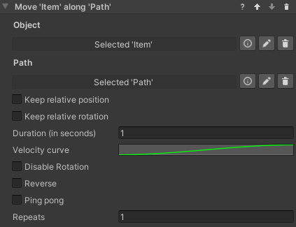
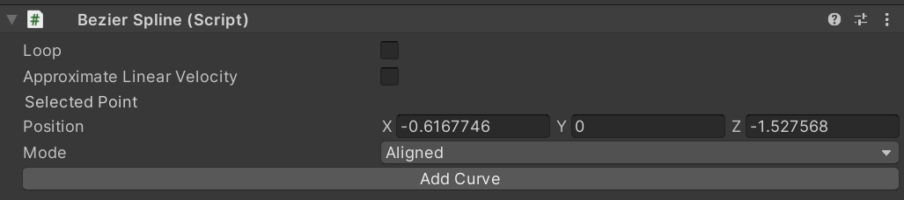

### Follow Path

#### Introduction

This behavior animates a game object so that it follows a path, for example a spline. It is possible to set a curve
determining how fast the object moves along the path, plus a number of options described below.
The behavior can be found under `Animation > Follow Path`.

#### Inspector

The **Follow Path** behavior accepts the following parameters.

**Object**: The game object to be moved.

**Path**: The path the object will follow. This needs to be an `IPathProperty`, like the `BezierSplinePathProperty`
provided in VR Builder Core.

**Keep relative position**: If unchecked, the object will be teleported on the path when the animation starts, and its
position throughout the animation will be on the path itself. If checked, the object will retain its current position
and move parallel to the path while animating.

**Keep relative rotation**: If unchecked, the object will rotate so that its forward vector follows the direction of the
path throughout the animation. If checked, the object will retain its current orientation, but still rotate following
the direction of the path.

**Duration (in seconds)**: Duration in seconds of the animation.

**Velocity curve**: This animation curve determines the object's position on the path at a given point in time. The
position on the path can be a value from 0 (start) to 1 (end). Note that the curve length is normalized: while it is
possible to have the time axis greater or lesser than 1, this won't affect the duration of the animation - the curve
will be extended or compressed to fit the provided time duration. The first key of the curve should always be at 0 on
the horizontal axis.

**Disable Rotation**:
If enabled, the object will not rotate while following the path and the settings on _Keep relative rotation_ will be
ignored.

**Reverse**: Utility checkbox that plays the animation backwards. It is equivalent to mirroring the velocity curve.

**Ping pong**: If this is checked, the animation will play backwards after finishing, resulting in the object animating
and then returning to the original position. Note the total duration will be twice the value in the `Duration` field.
This is similar to creating a symmetrical velocity curve, like for example a bell shape.

**Repeats**: The number of times the animation will repeat. Note that each repeat will increase the duration of the
animation by its full amount.

#### The Bezier Spline Path Property

The `BezierSplinePathProperty` is an implementation of the `IPathProperty` interface included in VR Builder core, and
can thus be used to create paths for the **Follow Path** behavior.
It's recommended to add it to an empty game object. It will automatically add a `BezierSpline` component, which will
display a default 4 point Bezier curve in the scene.

It is possible to select and move the points in 3D space to manipulate the curve.

We can see the position of the currently selected point in the inspector.

By clicking **Add Curve** in the `BezierSpline` inspector, we can add a second bezier curve connected to the current
one.

With a point selected in the inspector, it is possible to change the point mode.

The color of the point changes depending on the mode selected. The following modes are available.

**Free** (Magenta): The handles of the adjacent curves are independent, and can form a sharp angle if not aligned.

**Aligned** (Yellow): The handles of the adjacent curves are aligned, so there will be a smooth transition, but their
length can be set individually.

**Mirrored** (Cyan): The handles of the adjacent curves are aligned and of equal length.

Other options are:

**Loop**: Will close the path to form a loop. Especially useful with repeats, as the object will keep going around the
path.

**Approximate Linear Velocity**: Normally, velocities on a Bezier curve are non-linear. This means that, by default, the
object's speed will change depending on where it is on the path and which curve it is on. Enabling this option will make
the object approximate a linear speed, which means that the animation speed will be actually more faithful to the
animation curve.

**Granularity of Approximation**: This parameter is only exposed if `Approximate Linear Velocity` is selected. It
determines the number of segments each curve will be subdivided in, a higher value will result in a more constant speed
along the path, very low values (less than 10) can cause the object to change speed in a strange way. Lowering the value
can increase performance.

