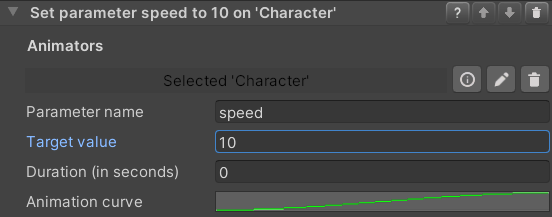

### Set Animator Parameter
#### Introduction
This set of behaviors allow to control the parameters of multiple `Animator` components from within VR Builder.
The included behaviors are:

- Set Animator Trigger Parameter
- Set Animator Boolean Parameter
- Set Animator Integer Parameter
- Set Animator Float Parameter

These behaviors set the specified parameter to the desired value immediately. The float variant can additionally change the parameter over time, following an animation curve.

#### Inspector

The inspector for these behaviors works similarly for all variants, although not all variants have all options. The behavior makes use of the following parameters.

**Animator**: `Process Scene Objects` containing an `Animator Property`. As usual, it is possible to automatically add the property, but the user should ensure there is a configured `Animator` component present on the same game object as the property.

**Parameter name**: The name of the parameters in the Animator as a string.

**Target value** (not present on trigger): The desired new value for the parameter. It is not present on the Set Animator Trigger behavior as triggers don't store values.

**Duration (in seconds)** (float only): The amount of time in seconds before the float parameter reaches its final value. If set to 0, the value will change instantly like in the other behaviors.

**Animation curve** (float only): Describes how the float value changes over time. The X axis represents the duration of the transition, while the Y axis represents the current value, with 0 being the initial value and 1 the target value.