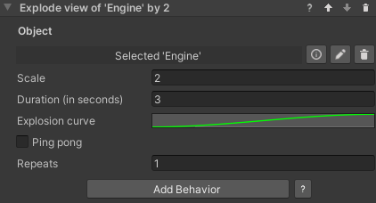

### Show Exploded View

#### Introduction

This behavior lets you easily create an exploded view of an object with a number of child objects. By default, all
immediate children of the specified game objects will be displaced by the specified factor relative to their current
local position. This means that children with a local position of zero will not be displaced. Note that you can create
empty objects with the desired relative positions in order to achieve the desired effect.

It is also possible to manually set which child objects will be displaced. You can do so by adding them to the
`Explodable Child Objects` list on the `Explodable Property` of the target object. If the list is not empty, only the
objects in the list will be exploded, otherwise all first-level children will be selected.

#### Inspector

**Object**: The game object to be exploded.

**Scale**: How much the children will displace themselves from their initial position. A scale of 1 represent the
initial position and can be used to un-explode the view. Values above 1 will explode the view, and below 1 will implode.

**Duration (in seconds)**: Duration in seconds of the animation.

**Explosion curve**: This curve determines the object's position at a given point in time. The curve can have values
from 0 (the child's original position) to 1 (the final position). Note that the length of the curves is normalized:
while it is possible to have the time axis greater or lesser than 1, this won't affect the duration of the animation -
it is recommended to leave the time axis to the default length of 0 to 1.

**Ping pong**: If this is checked, the animation will play backwards after finishing, resulting in the object animating
and then returning to the original position. Note the total duration will be twice the value in the `Duration` field.
This is similar to creating a symmetrical velocity curve, like for example a bell shape.

**Repeats**: The number of times the animation will repeat. Note that each repeat will increase the duration of the
animation by its full amount. If ping pong is set, it will be included in every repeat.
