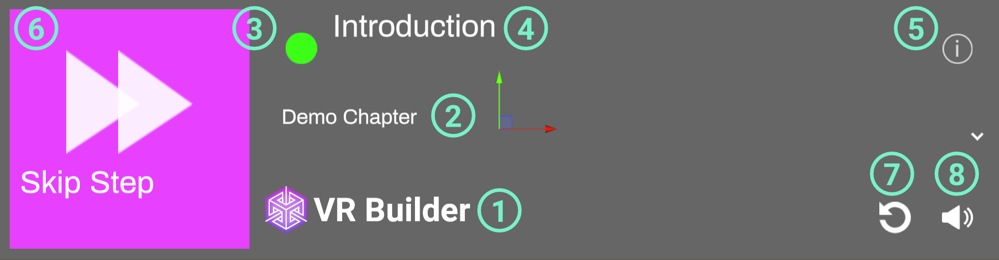

## How to Use the Menu

### Desktop Process Menu

The desktop process menu is laid out as follows.

1. VR Builder logo. Feel free to replace it with your own!
2. Current chapter. You can use the drop-down to skip to a later chapter.
3. Process state indicator. It appears when the process is running.
4. Name of the current step.
5. Info button. Click it to see the description of the current step.
6. Skip Step button. Clicking this button will fast-forward to the following step. If the process is not running, it is replaced by the Start Process button.
7. Restart process button. Clicking it will restart the process from the beginning.
8. Audio toggle. Enables/disables process audio.

The desktop menu can be used by clicking with the mouse on the desired option.

### Standalone Process Menu

The standalone process menu is laid out as follows.

1. VR Builder logo. Feel free to replace it with your own!
2. Current chapter. You can use the drop-down to skip to a later chapter.
3. Process state indicator. It appears when the process is running.
4. Name of the current step.
5. Info button. Click it to see the description of the current step.
6. Skip Step button. Clicking this button will fast-forward to the following step. If the process is not running, it is replaced by the Start Process button.
7. Restart process button. Clicking it will restart the process from the beginning.
8. Audio toggle. Enables/disables process audio.

The standalone menu is designed to be opened through user input. By default, the primary button on the right controller opens the menu. This can be changed on the `Standalone Menu Handler` component on the menu prefab. In case you want the menu to be permanently present in the scene, remove the `Standalone Menu Handler` component from the prefab.

In the inspector, it is possible to select which button can be used to open and close the menu.
The `Standalone Menu Handler` also takes care of repositioning the menu in front of the user every time it is opened.

To interact with the standalone menu, press the grip button on a controller to enter UI mode with that controller. This will change the hand to a pointing animation and visualize a ray originating from it. Point the ray to interactable elements on the menu and press the trigger button to activate them.