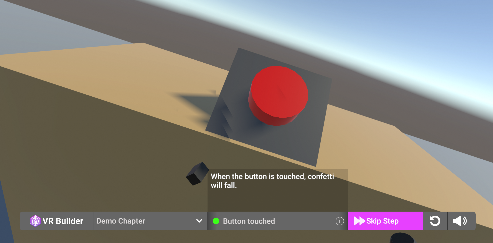

## Quick Start

Drag the prefabs `DesktopProcessControllerMenu` and `StandaloneProcessControllerMenu` into your VR Builder scene. The desktop menu will appear on the desktop screen when pressing Play (see image below). To open the standalone menu, press the primary button (usually the A button) on your controller.

The process starts automatically in VR Builder. If you want the process to be started from the menu, you will have to provide a custom `[PROCESS_CONTROLLER]`. You can find more information on how to do so [here](customizing-process-controller.md).
