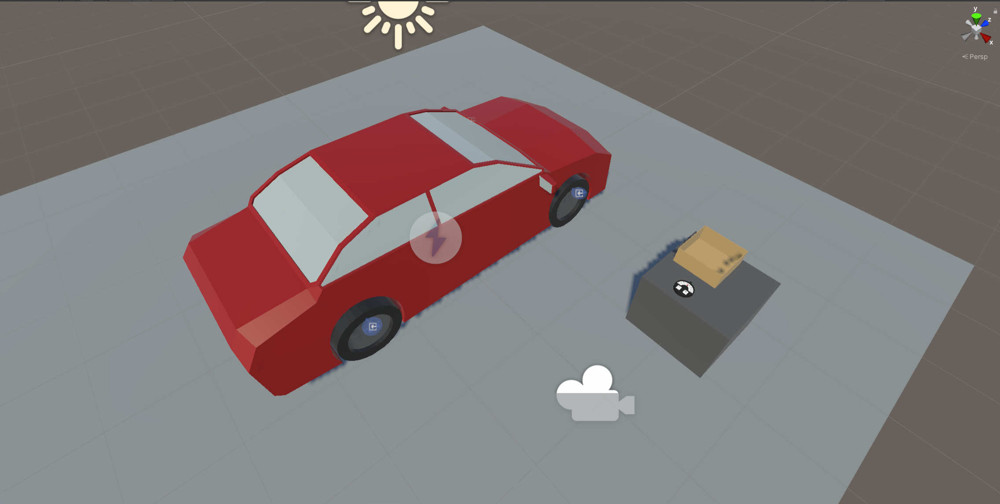

## Quick Start

You can check out the main features of this add-on in the provided demo scene. After importing the package in a properly set-up VR Builder project, you can access the demo scene from the menu `Tools > VR Builder > Demo Scenes > Randomization`. It is necessary to open the demo scene from the menu at least the first time, so a script will copy the required process file in the `StreamingAssets` folder.

In the demo scene, the user must check and change the pressure of the tires of a car by using a provided tool. It is a freeform process, where the user can check the tires in any order and even go back to previous ones. Once done, putting the tool in the box triggers the final evaluation.

This scene uses the `Random Branch` node to randomly select a scenario when the process starts, and the `Set Random Number` behavior to set the initial tire pressure to random values.

You can press Play to try out the scene, or open the Process Editor to check out how the process is made.

Additionally, you can find a tutorial on how this demo scene was created on our [website](https://www.mindport.co/vr-builder-learning-path/randomization-tutorial).

