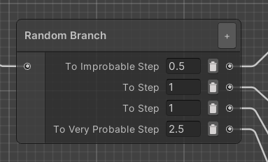

## The Random Branch Node

The Randomization add-on introduces a new type of node in addition to the standard step: the Random Branch node. This is a special kind of step that immediately routes the process to a random transition. This can be useful to add random events to your process.

To create it, select the new `Create Random Branch` option in the context menu.

The Random Branch node is designed so it can be configured directly in the Process Editor window. You can add and remove transitions at will, like any step. The fields to the left of the output port can be used to specify a weight, so it is possible for some transitions to be more probable than others.

By default, all weights are 1 and all transitions have equal chance to trigger. The weight can be any arbitrary number above or equal to zero. In the example above, the weights have a total of 5. This means that the `Very Probable Step` has a a 50% chance to be selected, while the `Improbable Step` only has one chance in ten.

Note that it can be useful to set a weight to zero for debugging purposes - such a transition will never be selected, so it is possible to steer the process through the desired nodes. If all weights in a node are equal to zero, however, the first transition will be selected.

### Logging the Random Branch node

If VR Builder is set to log step output in the Project Settings, Random Branch nodes will create a log entry stating which transition has been selected.