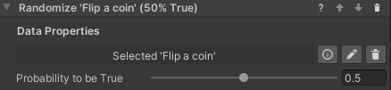

### Set Random Boolean Behavior

This behavior works similarly to the *Set Boolean* behavior, except the property is not set to a specific value.
Instead, it will be randomly set to *true* or *false* at runtime. It is possible to specify the probability of it to be
true by moving the slider from 0 (always false) to 1 (always true).

#### Configuration

* **Data Property**: The boolean data property to set to a random value.
* **Probability to be True**: The probability of the randomized value to be true measured from 0 (always false) to 1 (
  always true).
