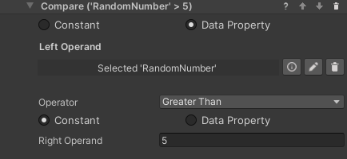

## Working with Data Properties

There are some standard tools to work with data properties. These are the Set/Reset Value behaviors, which are used to change the value stored in a data property, and the Compare Values conditions, which compare two values (from data properties or constant) to check if they are fulfilled.

### Set Value Behaviors

These behaviors set the value of a data property to a value specified in the step inspector. There is one behavior for each data property type. In the Randomization add-on, it is possible to set data properties of type Boolean and Number.

### Reset Value Behavior

This behavior resets a data property's value to its default. This is zero for numerical values and false for booleans, but a different default can be specified in the inspector of the data property. The property needs to be referenced in the step inspector, and will reset when the behavior is triggered.

### Compare Values Conditions

In the Randomization add-on it is possible to use a `Compare Numbers` or `Compare Booleans` condition. These can for example compare a random value to a constant in order to branch a process a certain way. They work in a similar way, but the comparison operators differ. You'll need to select two values and the operation between them. Use the radio buttons to select if a value comes from a data property or is a constant entered in the step inspector. In the example below, the condition will be fulfilled when the `RandomNumber` property is greater than 5.

### Logging Data Properties

It can be useful to log value changes to data properties in the console for debugging purposes. This can be enabled globally by ticking the relevant box in `Project Settings -> VR Builder -> Settings`.

If the `Log Data Property changes` checkbox is enabled, changes to the value of the data property will be logged in the console like the following example. Note that the name provided is the game object's name.

