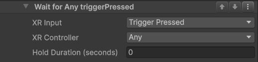

### Manual User Input Condition

The **Manual User Input Condition** checks if the user presses a specific button on their VR controller.  
When the selected input is pressed (or held for the required time), the step will move to the next one.

This condition has three configurable parameters that let you define exactly how the input should work.

---

#### Manual User Input Condition Parameters

- **XR Input**  
  Select which button or control the user must use.  
  Available options include:
  - Trigger  
  - Grip  
  - Primary button  
  - Secondary button  
  - Stick / Joystick  

- **XR Controller**  
  Choose which controller the user must use:
  - **Left Hand** – Only the left controller will trigger the condition.  
  - **Right Hand** – Only the right controller will trigger the condition.  
  - **Any** – Either controller can be used.  

- **Hold Duration (seconds)**  
  Set how long the selected input must be held down.
  - **0 (default):** The condition is met with a quick press.  
  - **Greater than 0:** The user must hold the button down for the specified number of seconds before the condition is met.  

  Example:  
  If this value is set to **2**, the user must hold the selected input for 2 seconds to continue.