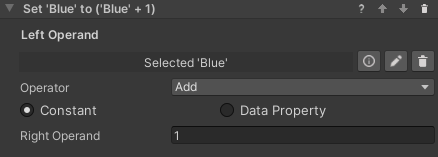

### Math Operation Behavior

The `Math Operation` behavior performs an operation on a data property and updates it with the result of the operation.
It takes three parameters, `Left Operand`, `Right Operand` and `Operator`.

`Left operand` is the data property that will be changed by the operation. `Right Operand` can either be another data
property or a constant value entered in the inspector.
`Operator` defines the type of operation to perform.
The operators currently available are listed here.

- **Add**: left + right
- **Subtract**: left - right
- **Multiply**: left * right
- **Divide**: left / right
- **Min**: change left to the lowest value between left and right
- **Max**: change left to the highest value between left and right

For example, the operation in the image will add 1 to the `Blue` data property.
