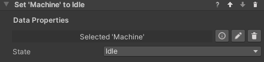

## State Data Properties

Sometimes we need to simulate a complex behavior that is part of the environment rather than the process. For example, a
machinery that can be idle, running, blocked or broken, or a door that can be locked, unlocked or open. In these case,
it might make sense to code the object's logic directly with Unity Monobehaviors rather than trying to write very
complex custom behaviors. This can also make sense if the object is independent from the process - for example, the
machine will keep running regardless of the user's position in the process, or is designed to break randomly.

Maybe we only want VR Builder to decide when the machine starts running, or to trigger a step when it breaks, but we
don't need it to be in control of what exact animation the object is into, or what sound it plays - these are
characteristics that are intrinsical to the machine, so we shouldn't care about them in the process.

We can use a `State Data Property` as a communication layer between our VR Builder process and some custom logic we have
written for an object. This is a data property which contains an `enum` listing all the states an object can be in. Like
all data properties, it can be read and set both from the Step Inspector and from code. This allows your custom logic
and the VR Builder process to interact with each other.

### Creating a State Data Property

You will need to define your `enum` and create a state data property specific to it.
For the machinery described above, it could look like this.

```csharp
public enum MachineState
{
    Idle,
    Running,
    Blocked,
    Broken,
}
```

We then need to create a data property component using this enum from the generic state data property. This is just a
couple lines.

```csharp
using VRBuilder.StatesAndData.Properties;

public class MachineStateDataProperty : StateDataProperty<MachineState>
{
}
```

We'll now be able to add this as a component to a game object. As it can be seen from the drop-down for the default
value, it makes use of the `MachineState` enum.


### Handling States in Code

We can read and modify states from code calling the `GetState` and `SetState` methods on the data property component.

```csharp
MachineStateDataProperty stateDataProperty = GetComponent<MachineStateDataProperty>();

// Set a state to a specified value.
stateDataProperty.SetState(MachineState.Running);

// Read the current state.
MachineState state = stateDataProperty.GetState(); 
```

It is also possible to subscribe to the standard data property events `ValueChanged` and `ValueReset`, respectively
called when the data property value changes or is reset to its default value.

```csharp
MachineStateDataProperty stateDataProperty = GetComponent<MachineStateDataProperty>();

// Subscribe to the value changed event.
dataProperty.ValueChanged += OnValueChanged;

// Function to be called when the event is triggered.
private void OnValueChanged(object sender, EventArgs e)
{    
    // Code to be executed on value changed.
}
```

### Set State Behavior

The `Set State` behavior can be used to change the property's state from the VR Builder process. It works very similarly
to the `Set Value` behavior, the only difference being that the state drop-down will not be visible until a
`State Data Property` is dragged in the inspector, as it depends on the provided enum.



It is also possible to use the `Reset Value` behavior on a `State Data Property`, it will work like any other data
property.

### Check State Condition

It is possible for a process to read a state and react accordingly using the `Check State` condition. This condition
compares a `State Data Property` to a specified value, in a way similar to other conditions comparing values.


A number of operations are available. Since enum values can be ordered, it is also possible to check if the state
precedes or follows the specified one.
