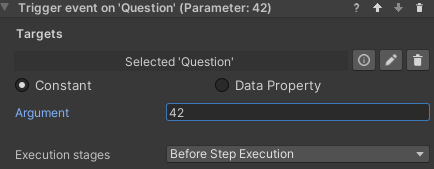

### Trigger Event Behaviors

This collection of behaviors let VR Builder trigger a Unity event on multiple scene objects. This gives you the freedom to bind your own functions to the event and execute custom code like it was a VR Builder behavior (although note that the behavior will end right after calling the event, so the next step could be activated immediately).

This is achieved through an event property which is added to the desired process scene object.

There are various permutations available for this behavior. It is possible to pass the following data to the event.
- No data
- Number (float)
- Text (string)
- Boolean

These value can be set in the behavior itself and can either be constant or data properties.

#### Trigger Event Behavior Parameters

- **Targets** References to the scene objects holding the event property we want to trigger.
- **Argument** (Behaviors with data only): Lets you specify a parameter to pass to the event. The type of the parameter (or corresponding data property) can be Number (float), Text (string) or Boolean (bool).
- **Execution stages**: Lets you select if the event is triggered as soon as the step starts, just before the step ends or both.