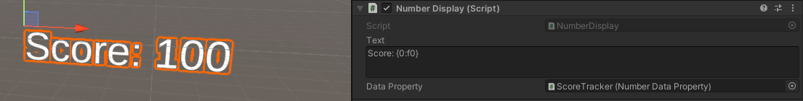

## Data Properties

This add-on makes use of data properties to store data values. A data property is a VR Builder property that stores one value of a defined data type, for example a number or a boolean. It is then possible to access those in the process steps to read or change the values.

### Creating Data Properties

We consider good practice to have each data property on a different, appropriately named empty game object, e.g. "Total Points" or "Assembly Time". This way it is easy to keep track of them and drag them in the step inspector when needed.

To create the property itself, just add a `Data Property` component of the required type to the game object, or do it directly in the step inspector through the usual "Fix it" button.

In the inspector, it is possible to type a default value for the data property. The property will have that value at the start of the process, and the `Reset Value` behavior will reset the property to that value.

### Data Property Displays

While data properties are assigned to game objects, they are just abstract values, and they are not visible in the scene. Yet, it can be useful to make them visible to the user. This add-on includes a few prefabs which can visualize the contents of data properties on a text mesh. They can be used as they are, or edited and combined with your own prefabs.

Start by dragging in the scene a display of the appropriate type (number, text, boolean or time). Then reference the desired data property in the `Data Property` field of the display component on the prefab. The display should already work when the process is started.

It is possible to configure the displayed text by editing the `Text` field of the display component. The following variables can be used:

- `{0}`: The value stored in the data property.
- `{1}`: The name of the game object the property is on.

These variables support the .NET string formatting rules as detailed [here](https://docs.microsoft.com/en-us/dotnet/standard/base-types/formatting-types). 
For example, you might want to limit the fractional digits of a number data property. Writing the variable as `{0:f2}` will always show two fractional digits, while writing it as `{0:f0}` will display only the integer part.
It is also possible to format time in the time display this way, for instance `{0:mm}:{0:ss}.{0:fff}` will display minutes, seconds and fractional digits formatted like "02:34.673".