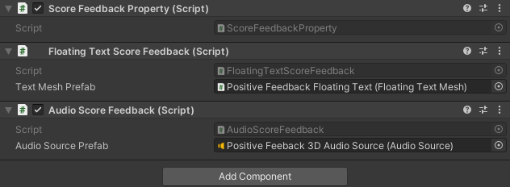

## Score Tracking

One of the aims of this add-on is to provide an easy way to track scores and quantify performance in a VR process. For
this, the main tool is the `Update Score` behavior, which can add or subtract from a numerical data property and trigger
relevant user feedback.

### Update Score Behavior

The `Update Score` behavior requires you to specify a `Number Data Property` holding the score and the amount increase.
Note that this can be a negative amount. When the behavior is triggered, the value in the data property will be updated
accordingly.


Additionally, you can add feedback to the score increase by referencing a feedback provider object in the
`Feedback property` field. If you do, you can also specify a process scene object which will provide the position for
position-dependent feedback, like the floating text in our default implementation.If no position provider is referenced,
feedback using a position parameter will default to the feedback provider object’s position.

### Feedback Providers

You can customize the user feedback for a score increase by adding score feedback components to a game object with a
`Score Feedback Property`. When the `Update Score` behavior triggers, every component on the game object will trigger
its feedback.

For example, we offer two prefabs, one for providing positive feedback, one for negative. Both play a sound and display
a floating number showing the score increase when triggered. If a position provider is specified in the behavior, both
the floating number and the sound will trigger at the specified position, else it will trigger at the feedback object's
position.



This happens because the game object includes both a `Floating Text Score Feedback` component and an
`Audio Score Feedback` component. These can be further configured by changing the prefabs they spawn, and new components
can be added.

#### Creating Custom Score Feedback Providers

Creating your own score feedback provider components requires minimal coding skills. Just create a component
implementing the `IScoreFeedbackProvider` interface and trigger your logic in the `TriggerFeedback` method.

```
public class MyScoreFeedbackProvider : MonoBehaviour, IScoreFeedbackProvider
{
    public void TriggerFeedback(float scoreDelta, float finalScore, Transform positionProvider)
    {
        // TODO Implement feedback logic.
    }
}
```

To customize your feedback, you can use the following parameters.

- `scoreDelta`: The score increase.
- `finalScore`: The total score after the increase.
- `positionProvider`: The transform where to trigger the feedback.
