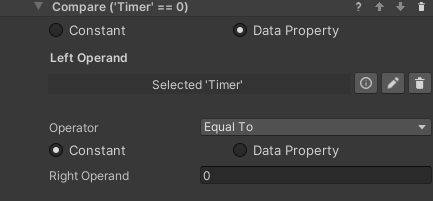
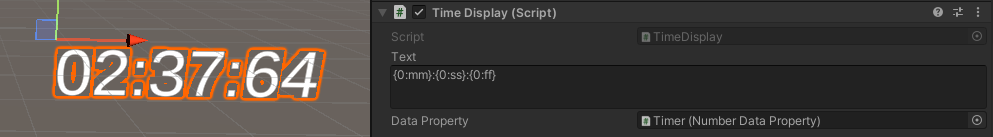

## Time Tracking

This add-on allows creating and managing timers which can be used for tracking performance or changing the state of the process. This is done mostly through the `Start Timer` and `Stop Timer` behaviors. Those interact with a `Timer Property` on a game object, which in turn stores the elapsed time (in seconds) in a `Number Data Property`. Since the time is stored in a standard property, it is possible to use it as any numerical data, for example by dragging the timer game object in a `Compare Values` condition, and to display it in the scene like other data properties.

### Start Timer Behavior

This behavior tells a `Timer Property` to start counting time in the attached `Number Data Property`, adding to the value already stored there. If `Is countdown` is selected, the timer will count down instead, and stop when zero is reached.

### Stop Timer Behavior

This behavior stops a running timer. It does nothing on a `Timer Property` that is not running. The `Number Data Property` will store the time at which the timer was stopped, and if the timer starts again it will start counting from that value.

### Resetting a Timer

Since a timer stores its data in a `Number Data Property`, a timer can be reset to 0 (or whatever default) by executing the `Reset Value` (or the `Set Number`) behavior on the timer's game object.

### Timer at Zero Condition

It may be common to need a condition that completes when a timer reaches zero. Since the time is stored in a `Number Data Property`, no specific tool is needed - simply use a `Compare Numbers Condition` to check if the time is equal to zero. In fact, you can compare the stored time to any value, keeping in mind that the time is stored in seconds.

### Displaying Time

Timers store their value in seconds in a `Number Data Property`. This means that of course a `Number Display` prefab will show that value. There is however one more prefab created specifically to show time: the `Time Display` shares many similarities with the `Number Display` but treats the value as time. By default it displays time in the mm:ss format, but that can be changed by editing the `Text` field. Since the field uses .NET formatting rules, it is possible to customize the time format as detailed [here](https://docs.microsoft.com/en-us/dotnet/standard/base-types/standard-timespan-format-strings).

