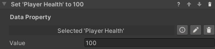

## Working with Data Properties

There are some standard tools to work with data properties. These are the Set/Reset Value behaviors, which are used to
change the value stored in a data property, and the Compare Values conditions, which compare two values (from data
properties or constant) to check fulfillment.

### Set Value Behaviors

The Track and Measure add-on provides this behavior in two flavors: `Set Number` and `Set Boolean`. They work the same
way: reference an object with a data property of the corresponding type, and input the new value. The value will change
when the behavior is triggered.

### Reset Value Behavior

This behavior resets a data property's value to its default. This is zero for numerical values, false for booleans and
an empty string for text, but a different default can be specified in the inspector of the data property. The property
needs to be referenced in the step inspector, and will reset when the behavior is triggered.
This can be useful for example for resetting a timer.

### Compare Values Conditions

In Track and Measure it is possible to use a `Compare Numbers` condition or a `Compare Booleans` condition. They work in
a similar way, but the comparison operators differ. You'll need to select two values and the operation between them. Use
the radio buttons to select if a value comes from a data property or is a constant entered in the step inspector. In the
example below, the condition will be fulfilled when the Score Tracker value is equal or greater than the Point Threshold
value.

