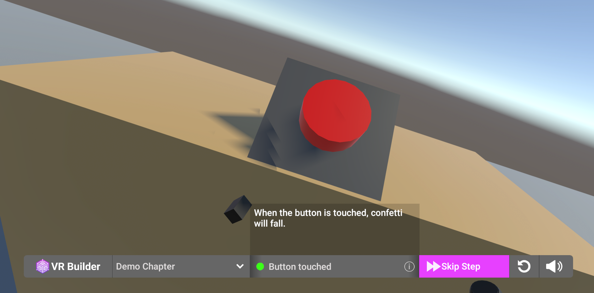
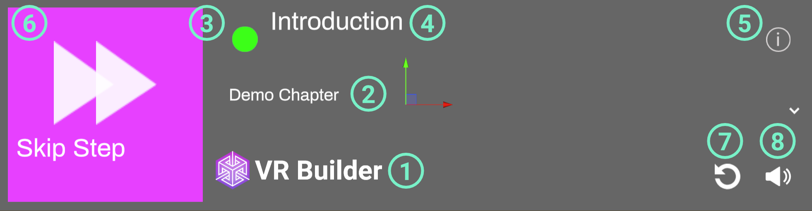
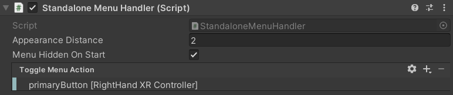
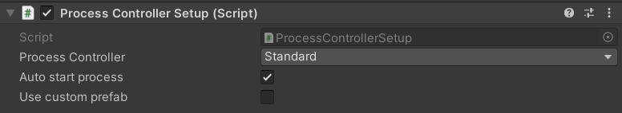

# Menus for VR Builder
## Table of Contents

- [Menus for VR Builder](#menus-for-vr-builder)
  - [Table of Contents](#table-of-contents)
  - [Introduction](#introduction)
  - [Quick Start](#quick-start)
  - [How to Use the Menu](#how-to-use-the-menu)
    - [Desktop Process Menu](#desktop-process-menu)
    - [Standalone Process Menu](#standalone-process-menu)
  - [Customizing the Process Controller](#customizing-the-process-controller)
  - [Contact](#contact)

## Introduction

This add-on provides examples on how to build a menu that allows to control the process execution in VR Builder. The menu allows to display the current step and its description, skip it by choosing a transition, switch chapters or restart the process.

Two prefabs are included. One displays the menu on the desktop screen, allowing an external person to control the process. This can be useful for example in training scenarios with a trainee in VR and a trainer at the computer.
The other displays the menu in VR, floating in front of the user. This can be useful for standalone headsets, which lack a flat screen view, or in cases where the user is supposed to control the process themselves.

## Quick Start

Drag one of the prefabs in the `Prefabs` folder in your process scene. The menu will appear when pressing Play. Feel free to try it out with the demo scene included in VR Builder!

The process starts automatically in VR Builder. If you want the process to be started from the menu, you will have to provide a custom `[PROCESS_CONTROLLER]`. You can find more information on how to do so [here](#customizing-the-process-controller).

## How to Use the Menu

### Desktop Process Menu

The desktop process menu is laid out as follows.

1. VR Builder logo. Feel free to replace it with your own!
2. Current chapter. You can use the drop-down to skip to a later chapter.
3. Process state indicator. It appears when the process is running.
4. Name of the current step.
5. Info button. Click it to see the description of the current step.
6. Skip Step button. Clicking this button will fast-forward to the following step. If the process is not running, it is replaced by the Start Process button.
7. Restart process button. Clicking it will restart the process from the beginning.
8. Audio toggle. Enables/disables process audio.

The desktop menu can be used by clicking with the mouse on the desired option.

### Standalone Process Menu

The standalone process menu is laid out as follows.

1. VR Builder logo. Feel free to replace it with your own!
2. Current chapter. You can use the drop-down to skip to a later chapter.
3. Process state indicator. It appears when the process is running.
4. Name of the current step.
5. Info button. Click it to see the description of the current step.
6. Skip Step button. Clicking this button will fast-forward to the following step. If the process is not running, it is replaced by the Start Process button.
7. Restart process button. Clicking it will restart the process from the beginning.
8. Audio toggle. Enables/disables process audio.

The standalone menu is designed to be opened through user input. By default, the primary button on the right controller opens the menu. This can be changed on the `Standalone Menu Handler` component on the menu prefab. In case you want the menu to be permanently present in the scene, remove the `Standalone Menu Handler` component from the prefab.

In the inspector, it is possible to select which button can be used to open and close the menu.
The `Standalone Menu Handler` also takes care of repositioning the menu in front of the user every time it is opened.

The standalone menu can be interacted with by pointing at it with a ray and pressing the trigger button.

## Customizing the Process Controller

The process controller can be configured on the `[PROCESS_CONTROLLER]` game object in a VR Builder scene. This object handles running the process and a few configuration parameters. The `Process Controller Setup` script lets you choose which process controller prefab is spawned when the scene runs.

It is possible to select one of the default process controller prefabs, or use a custom one by ticking the `Use custom prefab` box. It is also possible to select whether to auto start the process, or start it manually, for example through one of the menus provided in this add-on.

Both default process controllers automatically start the process when the scene runs. If you want to avoid that, so the process can be started from the menu, you'll have to create a custom process controller prefab. You can use one of the default ones found in `Assets\MindPort\VR Builder\Core\Source\Basic-UI-Component\Runtime\ProcessController\Resources\Prefabs` as a baseline.

The `Basic Process Loader` component ensures the process runs on scene start. To prevent this behavior, do not include this script in your custom controller.

## Contact

Join our official [Discord server](http://community.mindport.co) for quick support from the developer and fellow users. Suggest and vote on new ideas to influence the future of the VR Builder.

Make sure to review [VR Builder](https://assetstore.unity.com/packages/tools/visual-scripting/vr-builder-201913) and this [asset](https://u3d.as/2SNh) if you like it. It will help us immensely.

If you have any issues, please contact [contact@mindport.co](mailto:contact@mindport.co). We'd love to get your feedback, both positive and constructive. By sharing your feedback you help us improve - thank you in advance!
Let's build something extraordinary!

You can also visit our website at [mindport.co](http://www.mindport.co).