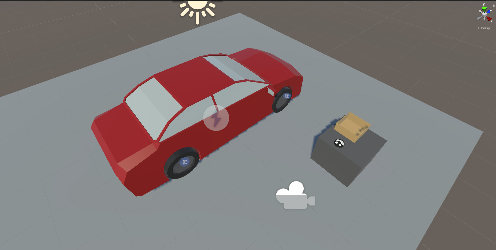
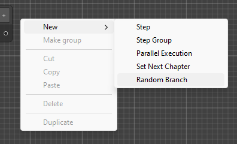
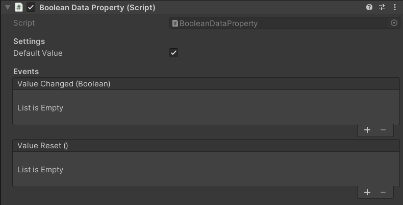
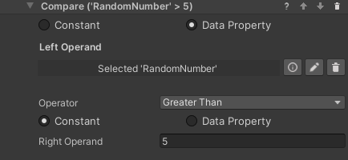
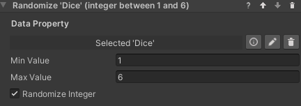

# Randomization for VR Builder
## Table of Contents

- [Randomization for VR Builder](#randomization-for-vr-builder)
  - [Table of Contents](#table-of-contents)
  - [Introduction](#introduction)
  - [Quick Start](#quick-start)
  - [The Random Branch Node](#the-random-branch-node)
    - [Logging the Random Branch node](#logging-the-random-branch-node)
  - [Data Properties](#data-properties)
    - [Creating Data Properties](#creating-data-properties)
  - [Working with Data Properties](#working-with-data-properties)
    - [Set Value Behaviors](#set-value-behaviors)
    - [Reset Value Behavior](#reset-value-behavior)
    - [Compare Values Conditions](#compare-values-conditions)
    - [Logging Data Properties](#logging-data-properties)
  - [Set Random Boolean Behavior](#set-random-boolean-behavior)
    - [Configuration](#configuration)
  - [Set Random Number Behavior](#set-random-number-behavior)
    - [Configuration](#configuration-1)
  - [Contact](#contact)

## Introduction

The Randomization add-on makes it easy to add unpredictability to a VR Builder process. It includes a new type of node, called Random Branch, which allows to add random events and alternative paths with zero effort.
Additionally, there are a couple tools to work with data properties: behaviors to set random booleans and numbers. You can use these to set random values for the process, and compare those values in condition, to make sure that every run of a process will be different than last time.

## Quick Start

You can check out the main features of this add-on in the provided demo scene. After importing the package in a properly set-up VR Builder project, you can access the demo scene from the menu `Tools > VR Builder > Demo Scenes > Randomization`. It is necessary to open the demo scene from the menu at least the first time, so a script will copy the required process file in the `StreamingAssets` folder.

In the demo scene, the user must check and change the pressure of the tires of a car by using a provided tool. It is a freeform process, where the user can check the tires in any order and even go back to previous ones. Once done, putting the tool in the box triggers the final evaluation.

This scene uses the `Random Branch` node to randomly select a scenario when the process starts, and the `Set Random Number` behavior to set the initial tire pressure to random values.

You can press Play to try out the scene, or open the Process Editor to check out how the process is made.

Additionally, you can find a tutorial on how this demo scene was created on our [website](https://www.mindport.co/vr-builder-learning-path/randomization-tutorial).

## The Random Branch Node

The Randomization add-on introduces a new type of node in addition to the standard step: the Random Branch node. This is a special kind of step that immediately routes the process to a random transition. This can be useful to add random events to your process.

To create it, select the new `Create Random Branch` option in the context menu.

The Random Branch node is designed so it can be configured directly in the Process Editor window. You can add and remove transitions at will, like any step. The fields to the left of the output port can be used to specify a weight, so it is possible for some transitions to be more probable than others.

By default, all weights are 1 and all transitions have equal chance to trigger. The weight can be any arbitrary number above or equal to zero. In the example above, the weights have a total of 5. This means that the `Very Probable Step` has a a 50% chance to be selected, while the `Improbable Step` only has one chance in ten.

Note that it can be useful to set a weight to zero for debugging purposes - such a transition will never be selected, so it is possible to steer the process through the desired nodes. If all weights in a node are equal to zero, however, the first transition will be selected.

### Logging the Random Branch node

If VR Builder is set to log step output in the Project Settings, Random Branch nodes will create a log entry stating which transition has been selected.

## Data Properties

This add-on makes use of data properties to store values. A data property is a VR Builder property that stores one value of a defined data type, for example a number or a boolean. It is then possible to access those in the process steps to read or change the values.

This add-on supports two types of data properties.

- **Number Data Property**: Stores a single number (C# type: float).
- **Boolean Data Property**: Stores a true/false value (C# type: bool).

### Creating Data Properties

We consider good practice to have each data property on a different, appropriately named empty game object, e.g. "Total Points". This way it is easy to keep track of them and drag them in the step inspector when needed.

To create the property itself, just add a `Data Property` component of the required type to the game object, or do it directly in the step inspector through "Fix it" button.

In the inspector, it is possible to type a default value for the data property. The property will have that value at the start of the process, and the `Reset Value` behavior will reset the property to its default.

## Working with Data Properties

There are some standard tools to work with data properties. These are the Set/Reset Value behaviors, which are used to change the value stored in a data property, and the Compare Values conditions, which compare two values (from data properties or constant) to check if they are fulfilled.

### Set Value Behaviors

These behaviors set the value of a data property to a value specified in the step inspector. There is one behavior for each data property type. In the Randomization add-on, it is possible to set data properties of type Boolean and Number.

### Reset Value Behavior

This behavior resets a data property's value to its default. This is zero for numerical values and false for booleans, but a different default can be specified in the inspector of the data property. The property needs to be referenced in the step inspector, and will reset when the behavior is triggered.

### Compare Values Conditions

In the Randomization add-on it is possible to use a `Compare Numbers` or `Compare Booleans` condition. These can for example compare a random value to a constant in order to branch a process a certain way. They work in a similar way, but the comparison operators differ. You'll need to select two values and the operation between them. Use the radio buttons to select if a value comes from a data property or is a constant entered in the step inspector. In the example below, the condition will be fulfilled when the `RandomNumber` property is greater than 5.

### Logging Data Properties

It can be useful to log value changes to data properties in the console for debugging purposes. This can be enabled globally by ticking the relevant box in `Project Settings -> VR Builder -> Settings`.

]

If the `Log Data Property changes` checkbox is enabled, changes to the value of the data property will be logged in the console like the following example. Note that the name provided is the game object's name.

## Set Random Boolean Behavior
This behavior works similarly to the *Set Boolean* behavior, except the property is not set to a specific value. Instead, it will be randomly set to *true* or *false* at runtime. It is possible to specify the probability of it to be true by moving the slider from 0 (always false) to 1 (always true).

### Configuration
* **Data Property**: The boolean data property to set to a random value.
* **Probability to be True**: The probability of the randomized value to be true measured from 0 (always false) to 1 (always true).

## Set Random Number Behavior
This behavior sets a number data property to a random value within a range.

### Configuration

* **Data Property**: The number data property to set to a random value.
* **Min Value**: The minimum value the randomized number can have.
* **Max Value**: The maximum value the randomized number can have.
* **Randomize Integer**: If checked, the randomized number will be an integer within the range. Otherwise it can be any float in the range.

## Contact

Join our official [Discord server](http://community.mindport.co) for quick support from the developer and fellow users. Suggest and vote on new ideas to influence the future of the VR Builder.

Make sure to review [VR Builder](https://assetstore.unity.com/packages/tools/visual-scripting/vr-builder-201913) and this [asset](https://u3d.as/2Stq) if you like it. It will help us immensely.

If you have any issues, please contact [contact@mindport.co](mailto:contact@mindport.co). We'd love to get your feedback, both positive and constructive. By sharing your feedback you help us improve - thank you in advance!
Let's build something extraordinary!

You can also visit our website at [mindport.co](http://www.mindport.co).
