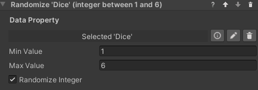

### Set Random Number Behavior
This behavior sets a number data property to a random value within a range.

#### Configuration

* **Data Property**: The number data property to set to a random value.
* **Min Value**: The minimum value the randomized number can have.
* **Max Value**: The maximum value the randomized number can have.
* **Randomize Integer**: If checked, the randomized number will be an integer within the range. Otherwise it can be any float in the range.
