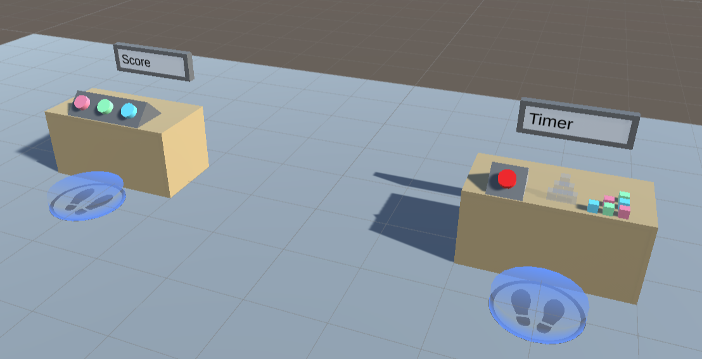

# Track and Measure for VR Builder
## Table of Contents

- [Track and Measure for VR Builder](#track-and-measure-for-vr-builder)
  - [Table of Contents](#table-of-contents)
  - [Introduction](#introduction)
  - [Quick Start](#quick-start)
  - [Data Properties](#data-properties)
    - [Creating Data Properties](#creating-data-properties)
    - [Data Property Displays](#data-property-displays)
  - [Working with Data Properties](#working-with-data-properties)
    - [Set Value Behaviors](#set-value-behaviors)
    - [Reset Value Behavior](#reset-value-behavior)
    - [Compare Values Conditions](#compare-values-conditions)
  - [Score Tracking](#score-tracking)
    - [Update Score Behavior](#update-score-behavior)
    - [Feedback Providers](#feedback-providers)
      - [Creating Custom Score Feedback Providers](#creating-custom-score-feedback-providers)
  - [Time Tracking](#time-tracking)
    - [Start Timer Behavior](#start-timer-behavior)
    - [Stop Timer Behavior](#stop-timer-behavior)
    - [Resetting a Timer](#resetting-a-timer)
    - [Timer at Zero Condition](#timer-at-zero-condition)
    - [Displaying Time](#displaying-time)
  - [Contact](#contact)

## Introduction

This add-on for VR Builder focuses on tracking performance of the VR user, and provides tools like timers and point trackers. With it, it is easy to measure the time taken to perform tasks and to assign scores while providing feedback to the user.

## Quick Start

You can check out the main features of this add-on in the provided demo scene. After importing the package in a properly set-up VR Builder project, you can access the demo scene from the menu `Tools > VR Builder > Demo Scenes > Track and Measure`. It is necessary to open the demo scene from the menu at least the first time, so a script will copy the required process file in the `StreamingAssets` folder.

The demo scene includes two stations, which highlight respectively point tracking and time tracking. Feel free to try those in VR. You can also open the Process Editor to see an example of how the provided conditions and behaviors can be used in a process.



## Data Properties

This add-on makes use of data properties to store data values. A data property is a VR Builder property that stores one value of a defined data type, for example a number or a boolean. It is then possible to access those in the process steps to read or change the values.

### Creating Data Properties

We consider good practice to have each data property on a different, appropriately named empty game object, e.g. "Total Points" or "Assembly Time". This way it is easy to keep track of them and drag them in the step inspector when needed.

To create the property itself, just add a `Data Property` component of the required type to the game object, or do it directly in the step inspector through the usual "Fix it" button.

In the inspector, it is possible to type a default value for the data property. The property will have that value at the start of the process, and the `Reset Value` behavior will reset the property to that value.


### Data Property Displays

While data properties are assigned to game objects, they are just abstract values, and they are not visible in the scene. Yet, it can be useful to make them visible to the user. This add-on includes a few prefabs which can visualize the contents of data properties on a text mesh. They can be used as they are, or edited and combined with your own prefabs.

Start by dragging in the scene a display of the appropriate type (number, text, boolean or time). Then reference the desired data property in the `Data Property` field of the display component on the prefab. The display should already work when the process is started.


It is possible to configure the displayed text by editing the `Text` field of the display component. The following variables can be used:

- `{0}`: The value stored in the data property.
- `{1}`: The name of the game object the property is on.

These variables support the .NET string formatting rules as detailed [here](https://docs.microsoft.com/en-us/dotnet/standard/base-types/formatting-types). 
For example, you might want to limit the fractional digits of a number data property. Writing the variable as `{0:f2}` will always show two fractional digits, while writing it as `{0:f0}` will display only the integer part.
It is also possible to format time in the time display this way, for instance `{0:mm}:{0:ss}.{0:fff}` will display minutes, seconds and fractional digits formatted like "02:34.673".

## Working with Data Properties

There are some standard tools to work with data properties. These are the Set/Reset Value behaviors, which are used to change the value stored in a data property, and the Compare Values conditions, which compare two values (from data properties or constant) to check fulfillment.

### Set Value Behaviors

The Track and Measure add-on provides this behavior in two flavors: `Set Number` and `Set Boolean`. They work the same way: reference an object with a data property of the corresponding type, and input the new value. The value will change when the behavior is triggered.


### Reset Value Behavior

This behavior resets a data property's value to its default. This is zero for numerical values, false for booleans and an empty string for text, but a different default can be specified in the inspector of the data property. The property needs to be referenced in the step inspector, and will reset when the behavior is triggered.
This can be useful for example for resetting a timer.


### Compare Values Conditions

In Track and Measure it is possible to use a `Compare Numbers` condition or a `Compare Booleans` condition. They work in a similar way, but the comparison operators differ. You'll need to select two values and the operation between them. Use the radio buttons to select if a value comes from a data property or is a constant entered in the step inspector. In the example below, the condition will be fulfilled when the Score Tracker value is equal or greater than the Point Threshold value.


## Score Tracking

One of the aims of this add-on is to provide an easy way to track scores and quantify performance in a VR process. For this, the main tool is the `Update Score` behavior, which can add or subtract from a numerical data property and trigger relevant user feedback.

### Update Score Behavior

The `Update Score` behavior requires you to specify a `Number Data Property` holding the score and the amount increase. Note that this can be a negative amount. When the behavior is triggered, the value in the data property will be updated accordingly.


Additionally, you can add feedback to the score increase by referencing a feedback provider object in the `Feedback property` field. If you do, you can also specify a process scene object which will provide the position for position-dependent feedback, like the floating text in our default implementation.If no position provider is referenced, feedback using a position parameter will default to the feedback provider object’s position.

### Feedback Providers

You can customize the user feedback for a score increase by adding score feedback components to a game object with a `Score Feedback Property`. When the `Update Score` behavior triggers, every component on the game object will trigger its feedback.

For example, we offer two prefabs, one for providing positive feedback, one for negative. Both play a sound and display a floating number showing the score increase when triggered. If a position provider is specified in the behavior, both the floating number and the sound will trigger at the specified position, else it will trigger at the feedback object's position.


This happens because the game object includes both a `Floating Text Score Feedback` component and an `Audio Score Feedback` component. These can be further configured by changing the prefabs they spawn, and new components can be added.

#### Creating Custom Score Feedback Providers

Creating your own score feedback provider components requires minimal coding skills. Just create a component implementing the `IScoreFeedbackProvider` interface and trigger your logic in the `TriggerFeedback` method.

```
public class MyScoreFeedbackProvider : MonoBehaviour, IScoreFeedbackProvider
{
    public void TriggerFeedback(float scoreDelta, float finalScore, Transform positionProvider)
    {
        // TODO Implement feedback logic.
    }
}
```

To customize your feedback, you can use the following parameters.
- `scoreDelta`: The score increase.
- `finalScore`: The total score after the increase.
- `positionProvider`: The transform where to trigger the feedback.

## Time Tracking

This add-on allows creating and managing timers which can be used for tracking performance or changing the state of the process. This is done mostly through the `Start Timer` and `Stop Timer` behaviors. Those interact with a `Timer Property` on a game object, which in turn stores the elapsed time (in seconds) in a `Number Data Property`. Since the time is stored in a standard property, it is possible to use it as any numerical data, for example by dragging the timer game object in a `Compare Values` condition, and to display it in the scene like other data properties.

### Start Timer Behavior

This behavior tells a `Timer Property` to start counting time in the attached `Number Data Property`, adding to the value already stored there. If `Is countdown` is selected, the timer will count down instead, and stop when zero is reached.

### Stop Timer Behavior

This behavior stops a running timer. It does nothing on a `Timer Property` that is not running. The `Number Data Property` will store the time at which the timer was stopped, and if the timer starts again it will start counting from that value.

### Resetting a Timer

Since a timer stores its data in a `Number Data Property`, a timer can be reset to 0 (or whatever default) by executing the `Reset Value` (or the `Set Number`) behavior on the timer's game object.

### Timer at Zero Condition

It may be common to need a condition that completes when a timer reaches zero. Since the time is stored in a `Number Data Property`, no specific tool is needed - simply use a `Compare Numbers Condition` to check if the time is equal to zero. In fact, you can compare the stored time to any value, keeping in mind that the time is stored in seconds.


### Displaying Time

Timers store their value in seconds in a `Number Data Property`. This means that of course a `Number Display` prefab will show that value. There is however one more prefab created specifically to show time: the `Time Display` shares many similarities with the `Number Display` but treats the value as time. By default it displays time in the mm:ss format, but that can be changed by editing the `Text` field. Since the field uses .NET formatting rules, it is possible to customize the time format as detailed [here](https://docs.microsoft.com/en-us/dotnet/standard/base-types/standard-timespan-format-strings).


## Contact

Join our official [Discord server](http://community.mindport.co) for quick support from the developer and fellow users. Suggest and vote on new ideas to influence the future of the VR Builder.

Make sure to review [VR Builder](https://assetstore.unity.com/packages/tools/visual-scripting/vr-builder-201913) and this [asset](https://u3d.as/2LdU) if you like it. It will help us immensely.

If you have any issues, please contact [contact@mindport.co](mailto:contact@mindport.co). We’d love to get your feedback, both positive and constructive. By sharing your feedback you help us improve - thank you in advance!
Let’s build something extraordinary!

You can also visit our website at [mindport.co](http://www.mindport.co).
