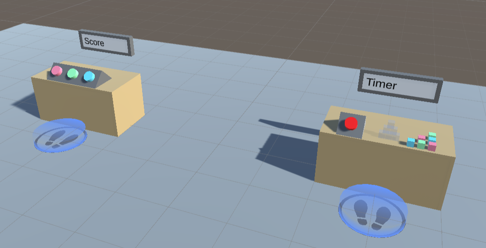

## Quick Start

You can check out the main features of this add-on in the provided demo scene. After importing the package in a properly set-up VR Builder project, you can access the demo scene from the menu `Tools > VR Builder > Demo Scenes > Track and Measure`. It is necessary to open the demo scene from the menu at least the first time, so a script will copy the required process file in the `StreamingAssets` folder.

The demo scene includes two stations, which highlight respectively point tracking and time tracking. Feel free to try those in VR. You can also open the Process Editor to see an example of how the provided conditions and behaviors can be used in a process.

